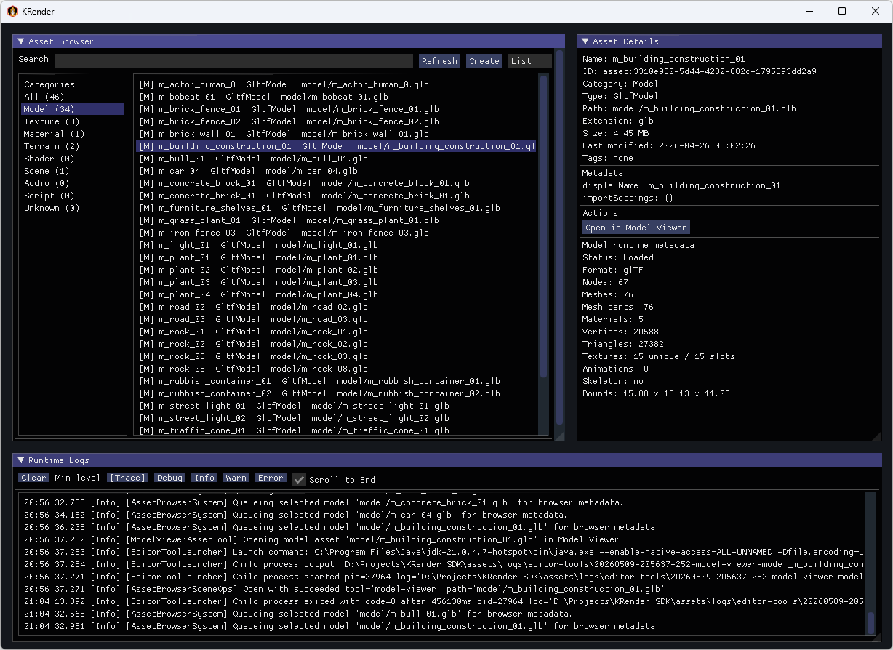
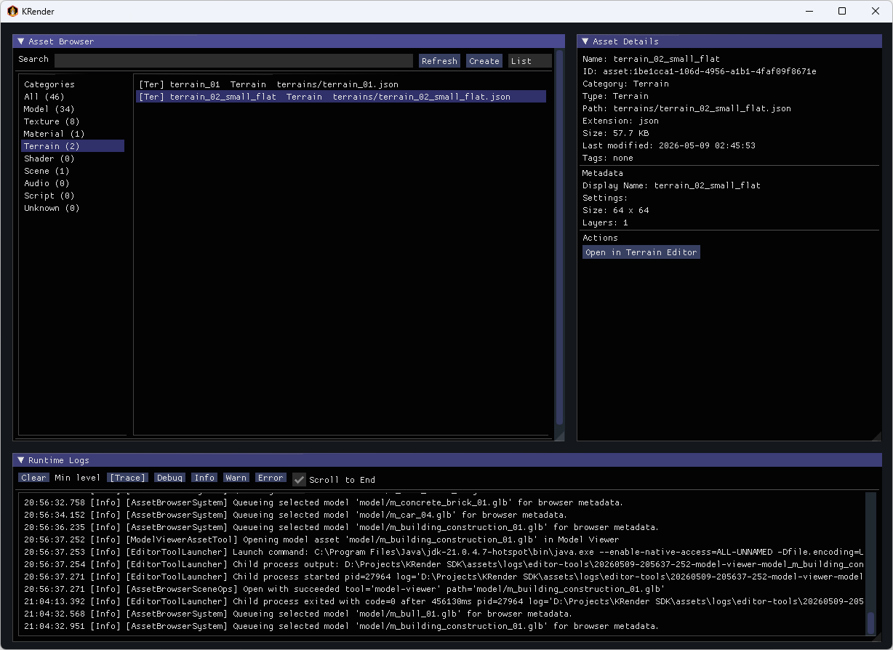
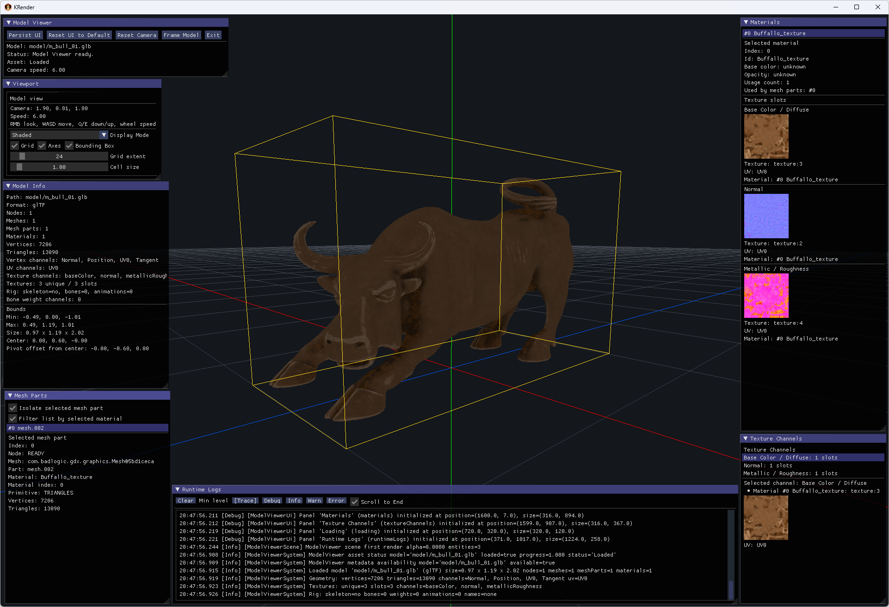
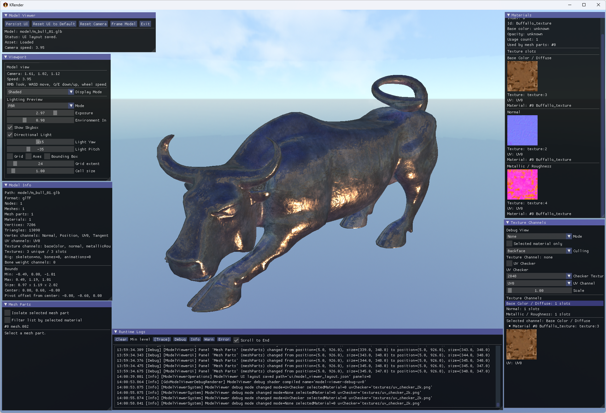
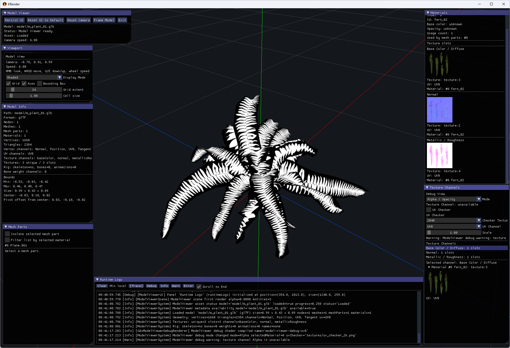
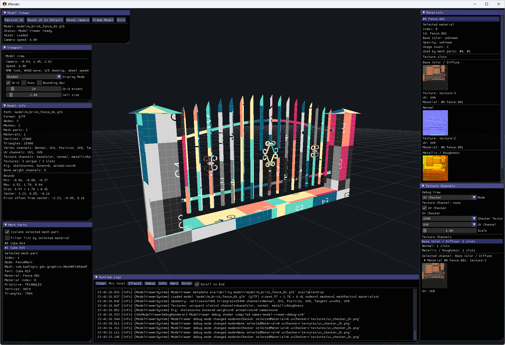
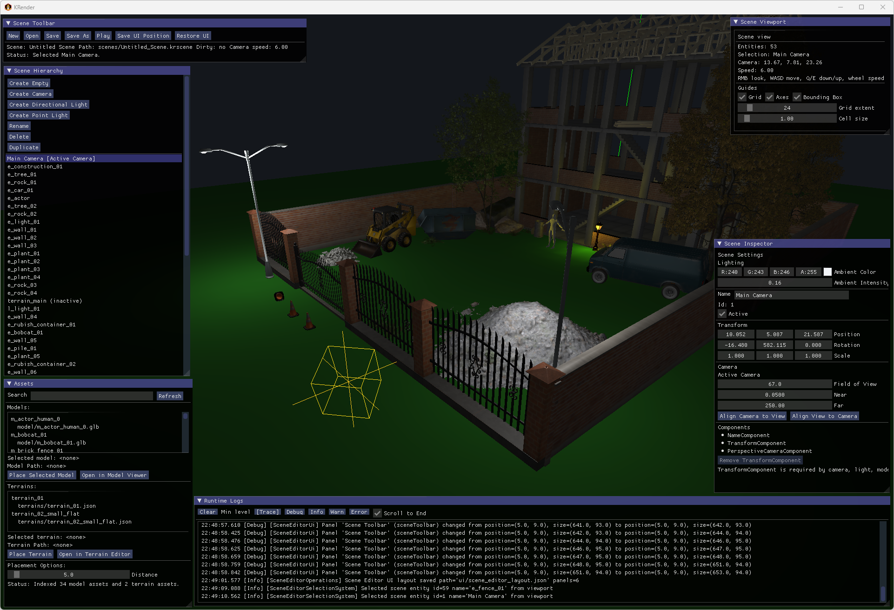
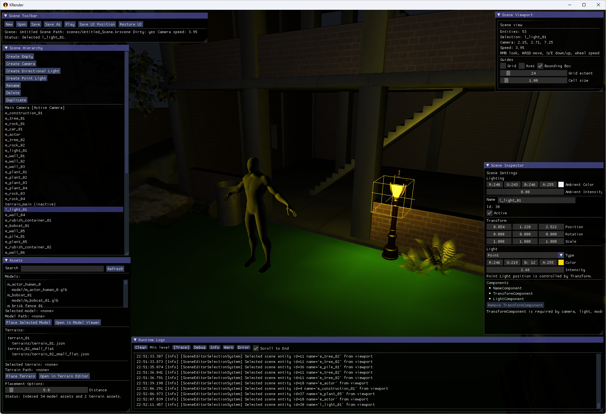

# KRender

KRender is a small Kotlin game engine and toolset for experimenting with game-engine architecture, rendering, assets,
scenes, and editor tools.

## Overview

KRender is a minimal game-engine project written in Kotlin.

The main idea is to provide a lightweight runtime where different scenes can be created, loaded, edited, and rendered
using a small set of reusable engine systems and services.

The project is focused on:

- learning how game engines are structured internally;
- experimenting with rendering, assets, scenes, terrain, models, and editor tools;
- building a Kotlin-first alternative to typical C# or C++ engine workflows;
- keeping the engine core small, modular, and backend-independent;
- supporting indie-style development where tools can grow together with the engine.

KRender provides a simple runtime, an ECS-style scene model, a desktop backend, and a set of editor tools for working
with assets, models, terrains, and scenes.

## Key Features

- **Scene-based runtime** with support for scene loading, switching, stacking, and lifecycle management.
- **ECS-style architecture** for organizing scene data, entities, components, systems, and update pipelines.
- **Backend-independent engine core** with a shared `EngineContext` for accessing engine services.
- **Asset management system** for loading and working with models, textures, terrains, shaders, and related metadata.
- **Input abstraction layer** for keyboard, mouse, pointer state, actions, axes, and UI input capture.
- **Structured logging and diagnostics** with in-memory logs, file logging, runtime stats, profiling, and editor log
  panels.
- **Rendering pipeline**, including models, terrain meshes, debug grids, axes, bounding boxes, wireframes, lights, and
  UI overlays.
- **Asset Browser** for browsing, managing, and opening project assets with registered tools.
- **Model Viewer** for inspecting model assets, mesh parts, materials, textures, animations, bounds, display modes,
  texture debug views, and glTF PBR preview rendering.
- **Terrain Editor** for creating, editing, previewing, saving, and loading terrain data.
- **Scene Editor** for building scenes with models, terrains, transforms, cameras, lights, selection, gizmos, and
  runtime preview.

## Architecture

KRender is organized around a small backend-facing runtime core:

```mermaid
flowchart TD
    Launcher["LWJGL3 Desktop Launcher"] --> App["GdxEngineApplication"]
    App --> Runtime["EngineRuntime"]

    Runtime --> Context["EngineContext"]
    Runtime --> Backend["EngineBackend"]

    Context --> Scenes["SceneManager"]
    Context --> Services["Input / Assets / UI / Logs / Tasks / Stats / Profiler"]

    Scenes --> Scene["Active Scene"]
    Scene --> World["SceneWorld"]
    World --> Systems["SystemPipeline"]

    Systems --> Update["Update scene state"]
    Systems --> RenderPrep["Build render commands"]
    RenderPrep --> Commands["RenderCommandBuffer"]

    Runtime --> Frame["Frame Loop"]
    Frame --> Update
    Frame --> Commands
    Commands --> Renderer["Renderer"]

    Backend --> Renderer
    Renderer --> Draw3D["Models / Terrain / Debug Geometry / Lights"]
    Renderer --> DrawUI["ImGui Editor Overlay"]
    Draw3D --> Gdx["LibGDX / OpenGL"]
    DrawUI --> Gdx
```



`EngineRuntime` owns the game loop and exposes backend services through `EngineContext`. Scenes and systems use the
context instead of directly constructing backend services.

## Engine Components

| Component                | Responsibility                                                                                                                                                                   | Location                                                      |
|--------------------------|----------------------------------------------------------------------------------------------------------------------------------------------------------------------------------|---------------------------------------------------------------|
| `EngineRuntime`          | Starts the runtime, owns `SceneManager`, advances frames, resizes, disposes services, and exposes `EngineContext`.                                                               | `engine/api/EngineRuntime.kt`                                 |
| `EngineContext`          | Stable facade for scenes and systems to access scenes, assets, scene files, runtime/tool launchers, input, UI, events, logging, logs, stats, profiler, tasks, and exit requests. | `engine/api/EngineRuntime.kt`                                 |
| `EngineBackend`          | Backend contract implemented by platform/runtime integrations.                                                                                                                   | `engine/api/EngineRuntime.kt`                                 |
| `SceneManager`           | Deferred scene stack transitions and scene activation/disposal.                                                                                                                  | `engine/api/Scene.kt`                                         |
| `Scene`                  | Base runtime scene with `world`, required assets, lifecycle hooks, and ECS forwarding.                                                                                           | `engine/api/Scene.kt`                                         |
| `SceneWorld`             | Entity storage, system pipeline, deferred mutation buffer, render command buffer, and typed queries.                                                                             | `engine/api/Ecs.kt`                                           |
| `Entity` / `Component`   | Runtime data model. Components include `TransformComponent`, `NameComponent`, `ParentComponent`, `VelocityComponent`, `LifetimeComponent`, and domain-specific components.       | `engine/api/Ecs.kt`                                           |
| `System`                 | Behavior unit with `onAdded`, `fixedUpdate`, `update`, `lateUpdate`, `render`, and `debugRender`.                                                                                | `engine/api/Ecs.kt`                                           |
| `AssetService`           | Schedules, updates, checks, inspects, previews, and unloads typed assets.                                                                                                        | `engine/api/Assets.kt`, `engine/backend/gdx/LibGdxBackend.kt` |
| `InputService`           | Frame-stable normalized input snapshots and cursor capture.                                                                                                                      | `engine/api/Input.kt`, `engine/backend/gdx/LibGdxBackend.kt`  |
| `UiService` / `UiSystem` | ImGui frame lifecycle, capture state, panel drawing, and texture preview drawing.                                                                                                | `engine/ui/Ui.kt`, `engine/backend/gdx/GdxImGuiService.kt`    |
| `Logger` / `LogService`  | Structured log entries, levels, history, sinks, and panels.                                                                                                                      | `engine/api/Debug.kt`, `engine/ui/LogsPanel.kt`               |
| `TaskService`            | Coroutine-based background, IO, main/render queue, and in-flight job tracking.                                                                                                   | `engine/api/Tasks.kt`, `engine/backend/gdx/LibGdxBackend.kt`  |
| `Renderer`               | Backend render submission for collected `RenderCommand` instances.                                                                                                               | `engine/api/Render.kt`, `engine/backend/gdx/LibGdxBackend.kt` |
| `SceneSerializer`        | Encodes and decodes `.krscene` scene descriptors and applies them to `SceneWorld`.                                                                                               | `engine/scene/SceneSerializer.kt`                             |

## Scene Lifecycle

The base `Scene` has lifecycle hooks for loading, asset scheduling, showing, updating, rendering, resizing, hiding, and
disposal.
The `SceneManager` defers scene transitions until the end of the current frame to avoid mid-frame state changes.

```kotlin
open suspend fun load(context: SceneLoadContext)
open fun scheduleAssets(assets: AssetService)
open fun show()
open fun fixedUpdate(dt: Float)
open fun update(dt: Float)
open fun lateUpdate(dt: Float)
open fun render(alpha: Float)
open fun debugRender()
open fun resize(width: Int, height: Int)
open fun hide()
open fun dispose()
```

## Game Loop

`GdxEngineApplication.render()` calls `EngineRuntime.renderFrame(Gdx.graphics.deltaTime)`. `GameLoop` clamps large frame
deltas with `EngineConfig.maxFrameDeltaSeconds` and runs a fixed-step accumulator using
`EngineConfig.fixedStepSeconds` (`1 / 60f` by default).

Current frame order:

1. Process input and capture the current input state.
2. Execute pending main-thread tasks.
3. Advance asset loading.
4. Apply pending scene transitions.
5. Run fixed updates if required.
6. Run the main scene update.
7. Run late update logic.
8. Collect render commands from the active scene and systems.
9. Submit the render context to the backend renderer.
10. Present the rendered frame.

Simplified pseudocode:

```kotlin
backend.ui.beginFrame(delta)
backend.input.beginFrame()
backend.tasks.flushMainThreadQueue()
backend.assets.update()

runtime.scenes.applyPendingTransitions(runtime)
val scene = runtime.scenes.currentScene ?: return

while (accumulator >= fixedStep) {
    scene.fixedUpdate(fixedStep)
    accumulator -= fixedStep
}

scene.update(delta)
scene.lateUpdate(delta)

backend.ui.endFrame()
scene.render(alpha)
scene.debugRender()

backend.renderer.render(
    RenderContext(scene, alpha, delta, scene.world.renderCommands.snapshot())
)

backend.input.endFrame()
```

## Tools

### Asset Browser

Asset Browser provides a file-explorer-like interface for browsing project assets, viewing metadata, and opening assets with registered tools.

It is the main entry point for working with local project assets. The browser scans configured asset roots, detects supported asset types, creates metadata sidecars when needed, and allows assets to be opened in the appropriate editor or viewer.

Model assets can be opened in Model Viewer, terrain assets in Terrain Editor, and scene assets in Scene Editor.

Features:

- Scans configured local asset directories for supported asset types.
- Detects model, texture, material, terrain, shader, scene, and unknown assets.
- Creates missing `.krmeta` metadata sidecars during registry scans.
- Uses `.krmeta` files to store asset metadata without modifying original source files.
- Supports search, category filters, list/grid view modes, and sorting by name, type, modified time, or size.
- Shows base asset info, texture metadata, terrain metadata, and model metadata when available.
- Opens assets with registered tools based on asset type.
- Supports create, rename, duplicate, delete, and reveal-in-files operations.
- Keeps asset files and metadata sidecars in sync during file operations.

Screenshots:




### Model Viewer

Model Viewer is a tool for opening and inspecting 3D model assets.

It provides a focused viewport where a single model can be loaded, viewed, and analyzed without opening a full scene. The tool is useful for checking imported models, validating materials, inspecting mesh structure, previewing animations, and verifying how the asset will look inside the engine.

Features:

- Opens model assets directly from Asset Browser or from a provided model path.
- Provides editor-style camera controls for orbiting, panning, zooming, and framing the model.
- Supports common viewport helpers such as grid, axes, bounding boxes, and wireframe overlays.
- Displays general model information such as format, bounds, mesh count, material count, vertices, and triangle count.
- Shows mesh parts, materials, texture channels, and animation metadata when available.
- Allows selecting and isolating individual mesh parts for easier inspection.
- Provides shaded, wireframe, and mixed shaded-wireframe display modes.
- Provides a renderer selector with `LibGDX (default)` and `PBR` modes for comparing the default backend path with a
  glTF-focused PBR preview.
- Uses the `gdx-gltf` PBR rendering path for `.gltf` and `.glb` models in PBR mode.
- Includes PBR preview controls for exposure, environment intensity, skybox visibility, directional light enablement,
  light yaw, and light pitch.
- Uses a default cubemap skybox texture asset for PBR previews, stored as a single cubemap cross/strip texture file.
- Provides shader-based material debug preview modes separate from viewport display modes.
- Can preview Base Color / Diffuse, Normal, Metallic / Roughness, Occlusion, Emission, and Alpha texture channels directly on the model surface when metadata is available.
- Includes UV checker preview using texture assets at 1024, 2048, and 4096 resolutions for validating UV layout and scale.
- Gives texture debug modes priority over PBR rendering, so material inspection stays stable when both features are
  available.
- Falls back safely and reports warnings when a model has no UVs or a requested texture channel is unavailable.
- Falls back safely and reports warnings when PBR preview is unavailable for a model or when optional skybox/IBL
  resources cannot be created on the active graphics backend.
- Shows texture previews when supported by the backend.
- Includes loading state, logs, and viewport layout controls.

Screenshots:










### Terrain Editor

Terrain Editor is used to create, edit, preview, save, and load terrain assets.

It focuses on heightfield-based terrain editing with brush tools, terrain layers, material previews, and dynamic mesh rendering. The tool is useful for experimenting with terrain generation workflows and preparing terrain assets for scenes.

Features:

- Create or load terrain assets.
- Configure terrain size and vertex spacing.
- Generate flat terrain, with extension points for noise-based generators.
- Edit terrain using brushes: raise, lower, flatten, smooth, and paint layer.
- Adjust brush radius, strength, falloff, and paint/erase behavior.
- Use undo and redo while editing terrain.
- Manage multiple terrain layers with materials, colors, visibility, tiling, and order.
- Preview terrain using layer colors, material colors, textures, or selected layer masks.
- Save and load terrain data.
- View mesh statistics, hover position, selected layer, preview state, and logs.

Screenshots:


### Scene Editor

Scene Editor is a lightweight scene composition tool for creating, editing, saving, and previewing `.krscene` files.

It is currently an MVP editor focused on the core scene-building workflow: placing assets, editing transforms, configuring cameras and lights, selecting objects, and running the scene in a separate runtime window.

Features:

- Create new scene files with default camera and light setup.
- Open, save, and save-as `.krscene` documents.
- Place model and terrain assets into the scene.
- Create empty entities, cameras, directional lights, and point lights.
- Edit entity names, active state, transforms, cameras, and light properties.
- Select entities from the viewport.
- Use hierarchy, inspector, asset placement, toolbar, viewport, and logs panels.
- Configure active camera settings and align camera/view when needed.
- Configure scene lighting, including ambient light, directional lights, and point lights.
- Render scene models and terrain assets in the editor viewport.
- Display editor helpers such as grid, axes, selected bounds, and light gizmos.
- Launch the saved scene in a separate runtime window for preview.

Screenshots:





## Example: Creating a Scene

This example uses the current `Scene`, `AssetRef`, `SceneWorld`, component, and system APIs.

```kotlin
package com.example

import com.pashkd.krender.engine.api.AssetPack
import com.pashkd.krender.engine.api.AssetRef
import com.pashkd.krender.engine.api.Component
import com.pashkd.krender.engine.api.Logger
import com.pashkd.krender.engine.api.Scene
import com.pashkd.krender.engine.api.SceneWorld
import com.pashkd.krender.engine.api.System
import com.pashkd.krender.engine.api.TransformComponent
import com.pashkd.krender.engine.render3d.Material
import com.pashkd.krender.engine.render3d.ModelComponent
import com.pashkd.krender.engine.render3d.ModelRenderSystem

data class RotationComponent(
    var degreesPerSecond: Float = 45f,
) : Component

class RotationSystem(
    private val logger: Logger,
) : System() {
    override fun onAdded(world: SceneWorld) {
        logger.info(TAG) { "RotationSystem added" }
    }

    override fun update(world: SceneWorld, dt: Float) {
        world.query<TransformComponent, RotationComponent>().forEach { entity ->
            val transform = entity.get<TransformComponent>() ?: return@forEach
            val rotation = entity.get<RotationComponent>() ?: return@forEach
            transform.eulerDegrees.y += rotation.degreesPerSecond * dt
        }
    }

    companion object {
        private const val TAG = "RotationSystem"
    }
}

class SpinningModelScene(
    private val modelPath: String,
) : Scene("spinning_model") {
    private val model = AssetRef.model(modelPath)

    override val requiredAssets: List<AssetPack> = listOf(
        object : AssetPack {
            override val assets = listOf(model)
        },
    )

    override fun show() {
        val entity = world.createEntity("Spinning Model")
        entity.add(ModelComponent(model = model, material = Material()))
        entity.add(RotationComponent(degreesPerSecond = 30f))

        world.systems.add(RotationSystem(engine.logger))
        world.systems.add(ModelRenderSystem())
    }
}
```

## Example: Creating a Custom System

Systems are added to `SceneWorld.systems` and receive the world plus phase timing. Use constructor injection for
services such as `Logger`, `InputService`, or `AssetService`.

```kotlin
import com.pashkd.krender.engine.api.Logger
import com.pashkd.krender.engine.api.SceneWorld
import com.pashkd.krender.engine.api.System
import com.pashkd.krender.engine.api.TransformComponent
import com.pashkd.krender.engine.api.VelocityComponent

class VelocitySystem(
    private val logger: Logger,
) : System() {
    override fun onAdded(world: SceneWorld) {
        logger.debug(TAG) { "VelocitySystem added to world with ${world.all().size} entities" }
    }

    override fun fixedUpdate(world: SceneWorld, dt: Float) {
        world.query<TransformComponent, VelocityComponent>().forEach { entity ->
            val transform = entity.get<TransformComponent>() ?: return@forEach
            val velocity = entity.get<VelocityComponent>() ?: return@forEach

            transform.position.x += velocity.value.x * dt
            transform.position.y += velocity.value.y * dt
            transform.position.z += velocity.value.z * dt
        }
    }

    companion object {
        private const val TAG = "VelocitySystem"
    }
}
```

## Logging

Logging is implemented in `engine/api/Debug.kt`.

Current types:

- `LogLevel`: `Trace`, `Debug`, `Info`, `Warn`, `Error`.
- `LogEntry`: structured log event with level, tag, message, frame, thread name, timestamp, and optional error.
- `Logger`: lazy message API with `trace`, `debug`, `info`, `warn`, and `error`.
- `LogService`: in-memory recent log history with `minLevel`, clear, sink registration, and sink removal.
- `EngineLogService`: default in-memory implementation and logger.
- `LogSink`: sink abstraction.
- `GdxAppLogSink`: mirrors structured logs to LibGDX application logging.
- `FileLogSink`: writes session-scoped log files under `logs/` relative to the current working directory.
- `LogsPanel`: ImGui panel used by Asset Browser, Model Viewer, Terrain Editor, and Scene Editor.

`LibGdxBackend` creates one `EngineLogService`, exposes it as both `logger` and `logs`, and registers the LibGDX and
file sinks.

Example:

```kotlin
engine.logger.info("MyScene") { "Scene started with ${world.all().size} entities" }
engine.logger.warn("Assets") { "Asset metadata is not available yet" }
engine.logger.error("Runtime", error) { "Failed to load scene: ${error.message}" }
```

## Getting Started

### Requirements

- JDK 11 or newer for normal development.
- Android SDK
- IntelliJ IDEA is recommended for Kotlin/Gradle development.

### Build

On Windows:

```powershell
.\gradlew.bat build
```

On Linux/macOS:

```bash
./gradlew build
```

## License

KRender is licensed under the Apache License, Version 2.0. See [LICENSE](LICENSE).
