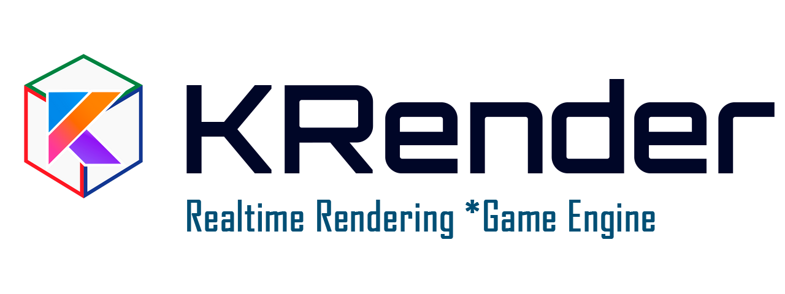
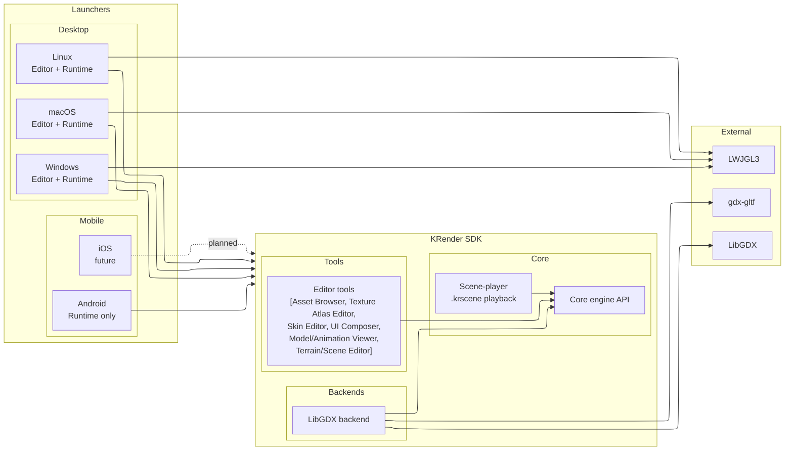
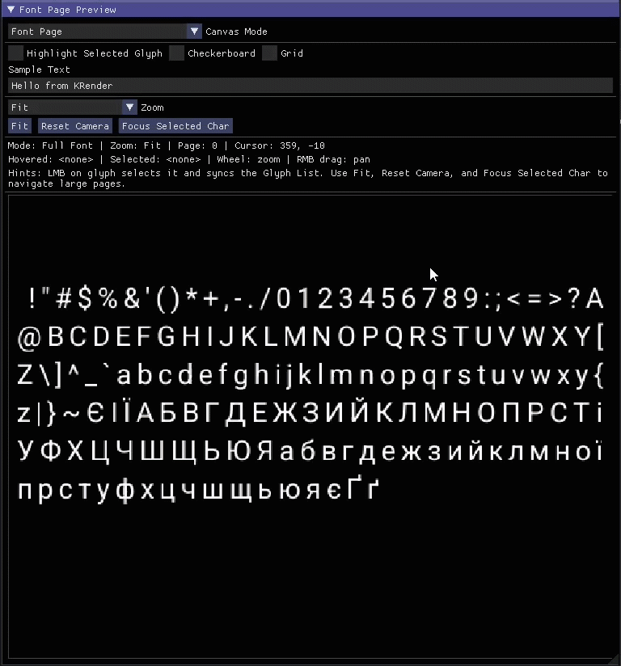
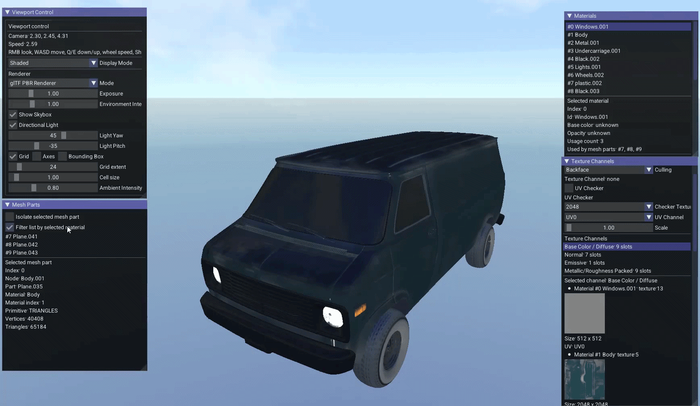
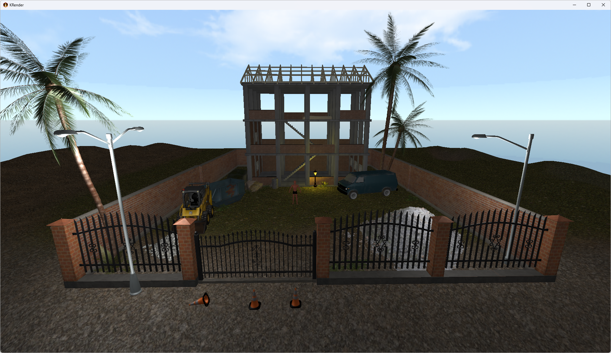
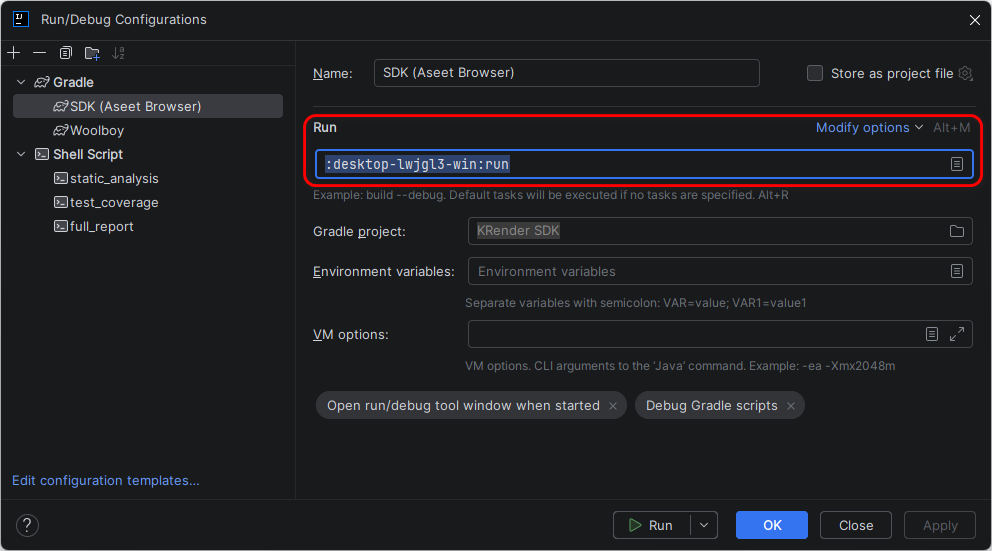
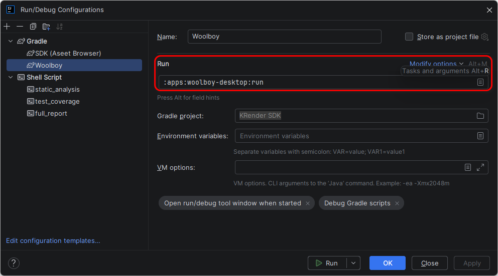

# KRender SDK



KRender SDK is a Kotlin + libGDX engine workspace built around a backend-neutral core, a separate LibGDX runtime backend module, a dedicated scene player module, and standalone editor tools for assets, models, animations, terrain, scenes, UI documents, and Scene2D Skin/style assets.

Hosted documentation: [dmytro-pashko.github.io/KRender](https://dmytro-pashko.github.io/KRender)

## Overview

KRender SDK is a small game-engine project written in Kotlin.

The main idea is to provide a lightweight runtime where different scenes can be created, loaded, edited, and rendered
using a reusable set of engine systems and services while keeping the engine core separate from the platform backend.

The project is focused on:

- learning how game engines are structured internally;
- experimenting with rendering, assets, scenes, terrain, models, and editor tools;
- building a Kotlin-first alternative to typical C# or C++ engine workflows;
- keeping the engine core small, modular, and backend-independent;
- supporting indie-style development where tools can grow together with the engine.

KRender provides a scene-based runtime, an ECS-style world model, a LibGDX backend, shared asset pipelines, and a set
of editor tools built on the same engine primitives. The repository now also contains a standalone Woolboy client split
into dedicated `games/` and `apps/` modules so the engine/SDK and a sample client application stay clearly separated.

## Key Features

- **Scene-based runtime** with support for scene loading, switching, stacking, and lifecycle management.
- **ECS-style architecture** for organizing scene data, entities, components, systems, and update pipelines.
- **Backend-independent engine core** with a shared `EngineContext` for accessing engine services.
- **Asset management system** for loading and working with models, textures, terrains, shaders, and related metadata.
- **Input abstraction layer** for keyboard, mouse, pointer state, actions, axes, and UI input capture.
- **Structured logging and diagnostics** with in-memory logs, file logging, runtime stats, profiling, and editor log
  panels.
- **Rendering pipeline**, including models, terrain meshes, debug grids, axes, bounding boxes, wireframes, lights, and
  UI overlays.
- **Scene Player** for runtime playback of `.krscene` scene documents.
- **Editor tools** for browsing assets and inspecting or authoring models, animations, terrain, scenes, UI documents, and Scene2D Skin/style assets.
- **Scene2D UI asset workflow** covering atlas packing, skin/style editing, and visual UI composition through dedicated tools.

## Repository Structure

KRender is organized around a backend-neutral SDK core, platform launchers, editor tools, and a sample game app.



See the full architecture and repository breakdown in [docs/architecture.md](docs/architecture.md).

## Toolset

KRender ships a set of standalone editor tools built on the same engine primitives as the runtime.
Full tool documentation is at [docs/tools.md](docs/tools.md).

For larger screenshots, feature lists, launch parameters, and tool-by-tool explanations, see the detailed tool guide in [docs/tools.md](docs/tools.md).

### Scene2D UI Authoring Workflow

<details>
<summary><strong>Preview the current UI tooling workflow</strong></summary>

<p>Animated previews keep the main page cleaner while still showing the tools in action.</p>

<p><strong>Texture Atlas Editor</strong></p>


<p><strong>Texture Atlas Editor (NinePatch preview)</strong></p>


<p><strong>Bitmap Font Editor</strong></p>


</details>

### 3D And Scene Tools

- **Model Viewer** — single-model inspection with PBR preview, debug channels, and UV checker.

<details>
<summary><strong>Preview Model Viewer</strong></summary>

<p>Animated previews keep the main page cleaner while still showing the Model Viewer in action.</p>

<p><strong>Viewport controls and rendering options</strong><br/>
Toggle helpers such as grid, bounds, and axes, then compare display modes and renderer behavior while inspecting the same model.</p>


<p><strong>Texture-channel inspection in glTF PBR Renderer</strong><br/>
Switch between metallic and roughness visualization to validate packed material textures directly on the model.</p>


<p><strong>Mesh-part and material isolation workflow</strong><br/>
Inspect how geometry maps to materials by selecting materials and isolating the matching mesh parts.</p>



</details>

- **Animation Viewer** — clip playback, skeleton hierarchy, and pose overlay.

<details>
<summary><strong>Preview Animation Viewer</strong></summary>


</details>

- **Terrain Editor** — heightfield sculpting and painting with layers and materials.

<details>
<summary><strong>Preview Terrain Editor</strong></summary>


</details>

- **Scene Editor** — `.krscene` authoring with entity hierarchy, transforms, cameras, and lights.

<details>
<summary><strong>Preview Scene Editor</strong></summary>


</details>

- **Scene Player** — runtime playback of saved `.krscene` files.

<details>
<summary><strong>Preview Scene Player</strong></summary>



</details>

## AI-Oriented Development

KRender is maintained with AI and coding-agent collaboration in mind.

- Repository-wide guidance lives in `AGENTS.md`.
- Deeper architecture and subsystem docs live under `docs/agents/`.
- Tool-specific context files live under `docs/agents/tools/`.
- Agents should read the relevant tool or subsystem doc before making non-trivial changes.
- User-facing tool documentation lives in [engine/tools/README.md](engine/tools/README.md).

## Example Apps

### Woolboy

Woolboy is now packaged as a **standalone client application** on top of KRender SDK instead of an in-core sandbox
scene.

Module split:

- `core` — KRender backend-neutral engine API/data and shared services
- `engine:backend-gdx` — LibGDX backend adapter
- `games:woolboy` — Woolboy gameplay/client module
- `apps:woolboy-desktop` — executable desktop app and fat-JAR task

Woolboy runtime assets live in:

```text
games/woolboy/src/main/resources/assets/woolboy/
```

Build the executable JAR:

```powershell
.\gradlew.bat :apps:woolboy-desktop:woolboyJar
```

Run it:

```powershell
java -jar apps/woolboy-desktop/build/libs/woolboy-demo.jar
```

The Woolboy app bundles its curated `assets/woolboy` runtime content inside the JAR and does not require
`-Dkrender.scene=...`. See `games/woolboy/woolboy.md` for the app-specific layout and build notes.

Run the SDK desktop host from IntelliJ IDEA:



Run Woolboy from IntelliJ IDEA:



## Getting Started

### Requirements

- JDK 11 or newer for normal development.
- Android SDK for the `android` module / full multi-project builds.
- IntelliJ IDEA is recommended for Kotlin/Gradle development.

### Build

Fast JVM compile check on Windows:

```powershell
.\gradlew.bat :core:compileKotlin :engine:backend-gdx:compileKotlin :engine:tools:compileKotlin :engine:scene-player:compileKotlin :desktop-lwjgl3-win:compileKotlin :desktop-lwjgl3-macos:compileKotlin :desktop-lwjgl3-linux:compileKotlin
```

Run JVM tests:

```powershell
.\gradlew.bat :core:test :engine:scene-player:test
```

Build the standalone Woolboy modules only:

```powershell
.\gradlew.bat :games:woolboy:build :apps:woolboy-desktop:build
.\gradlew.bat :apps:woolboy-desktop:woolboyJar
```

Full workspace build:

```powershell
.\gradlew.bat build
```

The full workspace build includes the `android` module and may require a configured Android SDK.

On Linux/macOS:

```bash
./gradlew :core:compileKotlin :engine:backend-gdx:compileKotlin :engine:tools:compileKotlin :engine:scene-player:compileKotlin :desktop-lwjgl3-win:compileKotlin :desktop-lwjgl3-macos:compileKotlin :desktop-lwjgl3-linux:compileKotlin
./gradlew :core:test :engine:scene-player:test
./gradlew build
```

### Quality Scripts

Quality scripts live under `scripts/` and can be run from the repository root:

```bash
./scripts/format_check.sh
./scripts/static_analysis.sh
./scripts/unit_test_coverage.sh
./scripts/full_report.sh
```

Safe Kotlin formatting plus verification:

```bash
./scripts/format_check.sh --fix
```

`full_report.sh` runs formatting checks, static analysis, and unit test coverage. Reports are written under `build/reports/`, including `build/reports/static-analysis/`, `build/reports/unit-test-coverage/`, `build/reports/full-report/`, and `build/reports/detekt/`. The legacy `scripts/static-analysis.sh` wrapper remains available for compatibility.

## Open Source Projects Used

KRender is built on top of several open source projects that provide the language, runtime, rendering, and tooling
foundations of the SDK:

- **Kotlin** - primary language used across the engine, including Kotlin ecosystem libraries used by the project.
  Website: [kotlinlang.org](https://kotlinlang.org/)
  Repository: [github.com/JetBrains/kotlin](https://github.com/JetBrains/kotlin)
- **libGDX** - cross-platform runtime framework used for rendering, input, audio, assets, desktop launchers, and Android integration.
  Website: [libgdx.com](https://libgdx.com/)
  Repository: [github.com/libgdx/libgdx](https://github.com/libgdx/libgdx)
- **gdx-gltf** - glTF 2.0 loading and PBR rendering support used by the 3D model pipeline and preview tooling.
  Repository: [github.com/mgsx-dev/gdx-gltf](https://github.com/mgsx-dev/gdx-gltf)
- **LWJGL 3** - native desktop windowing and OpenGL bindings underneath the desktop LibGDX backend.
  Website: [lwjgl.org](https://www.lwjgl.org/)
  Repository: [github.com/LWJGL/lwjgl3](https://github.com/LWJGL/lwjgl3)

## License

KRender is licensed under the Apache License, Version 2.0. See [LICENSE](LICENSE).
