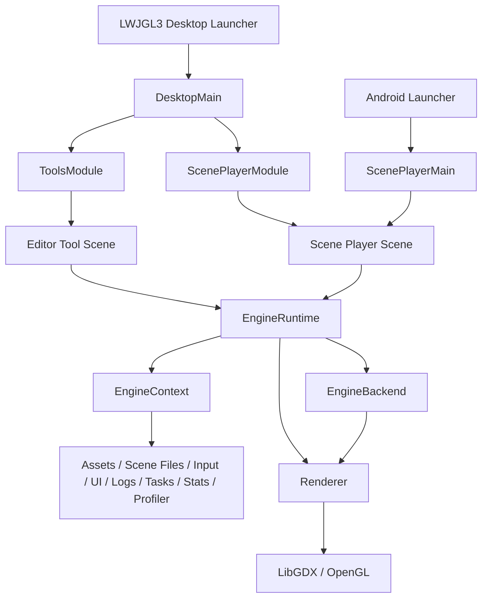

# KRender SDK

KRender SDK is a Kotlin + libGDX engine workspace built around a backend-neutral core, a LibGDX runtime backend, a dedicated scene player module, and standalone editor tools for assets, models, animations, terrain, scenes, and UI documents.

## Overview

KRender SDK is a small game-engine project written in Kotlin.

The main idea is to provide a lightweight runtime where different scenes can be created, loaded, edited, and rendered
using a reusable set of engine systems and services while keeping the engine core separate from the platform backend.

The project is focused on:

- learning how game engines are structured internally;
- experimenting with rendering, assets, scenes, terrain, models, and editor tools;
- building a Kotlin-first alternative to typical C# or C++ engine workflows;
- keeping the engine core small, modular, and backend-independent;
- supporting indie-style development where tools can grow together with the engine.

KRender provides a scene-based runtime, an ECS-style world model, a LibGDX backend, shared asset pipelines, and a set
of editor tools built on the same engine primitives. The repository now also contains a standalone Woolboy client split
into dedicated `games/` and `apps/` modules so the engine/SDK and a sample client application stay clearly separated.

## Key Features

- **Scene-based runtime** with support for scene loading, switching, stacking, and lifecycle management.
- **ECS-style architecture** for organizing scene data, entities, components, systems, and update pipelines.
- **Backend-independent engine core** with a shared `EngineContext` for accessing engine services.
- **Asset management system** for loading and working with models, textures, terrains, shaders, and related metadata.
- **Input abstraction layer** for keyboard, mouse, pointer state, actions, axes, and UI input capture.
- **Structured logging and diagnostics** with in-memory logs, file logging, runtime stats, profiling, and editor log
  panels.
- **Rendering pipeline**, including models, terrain meshes, debug grids, axes, bounding boxes, wireframes, lights, and
  UI overlays.
- **Scene Player** for runtime playback of `.krscene` scene documents.
- **Editor tools** for browsing assets and inspecting or authoring models, animations, terrain, scenes, and UI documents.

## Repository Structure

```text
KRender SDK/
+-- core/                  # Backend-neutral API, LibGDX backend adapter, shared runtime services, serializers, terrain/runtime infrastructure
|   +-- src/main/kotlin/com/pashkd/krender/
|   |   +-- engine/
|   |   |   +-- api/                      # Backend-neutral runtime API
|   |   |   +-- backend/gdx/              # LibGDX backend; owns all Gdx.* and OpenGL access
|   |   |   +-- assets/                   # Shared asset registry, metadata, import/export services
|   |   |   +-- render3d/                 # 3D components, environment, render systems
|   |   |   +-- scene/                    # Scene config, serialization, file and launcher services
|   |   |   +-- terrain/                  # Shared terrain runtime/persistence
|   |   |   +-- ui/editor/                # Editor UI service contracts and shared ImGui helpers
|   |   |   +-- ui/runtime/               # Scene2D runtime UI service
|   |   |   +-- ui/scene/                 # `.krui` model, serializer, validators
|   |   +-- game/                         # Shared game-facing helpers that are not standalone tool/player routes
|   +-- src/test/kotlin/...               # Pure JVM unit tests
+-- engine/
|   +-- scene-player/                     # `.krscene` runtime player route and scene-player module docs
|   +-- tools/                            # Editor/development tools, tool routing, and editor-only helpers
+-- games/
|   +-- woolboy/                          # Standalone Woolboy gameplay/client module + bundled assets
+-- apps/
|   +-- woolboy-desktop/                  # Standalone Woolboy desktop launcher + executable JAR task
+-- lwjgl3/                # Main desktop launcher for KRender tools/runtime
+-- android/               # Android launcher (requires Android SDK to build)
+-- assets/                # Shared assets for the main editor/runtime application
+-- docs/                  # Architecture notes, tool docs, screenshots, quality docs
```

Gradle subprojects currently loaded by `settings.gradle`:

- `core`
- `engine:scene-player`
- `engine:tools`
- `lwjgl3`
- `android`
- `games:woolboy`
- `apps:woolboy-desktop`

The root `assets/` directory remains the shared asset tree for the editor/runtime app. Woolboy ships its own curated
runtime content from `games/woolboy/src/main/resources/assets/woolboy/`.

The intended dependency direction is:

```text
engine:tools -> core
engine:scene-player -> core
lwjgl3 -> core + engine:tools + engine:scene-player + desktop backend libraries
android -> core + engine:scene-player
games:woolboy -> core
apps:woolboy-desktop -> games:woolboy + core
```

## Architecture

KRender is organized around a small backend-facing runtime core:



`EngineRuntime` owns the game loop and exposes backend services through `EngineContext`. Scenes and systems use the
context instead of directly constructing backend services.

## Engine Components

| Component                | Responsibility                                                                                                                                                                   | Location                                                      |
|--------------------------|----------------------------------------------------------------------------------------------------------------------------------------------------------------------------------|---------------------------------------------------------------|
| `EngineRuntime`          | Starts the runtime, owns `SceneManager`, advances frames, resizes, disposes services, and exposes `EngineContext`.                                                               | `engine/api/EngineRuntime.kt`                                 |
| `EngineContext`          | Stable facade for scenes and systems to access scenes, assets, scene files, runtime/tool launchers, input, UI, events, logging, logs, stats, profiler, tasks, and exit requests. | `engine/api/EngineRuntime.kt`                                 |
| `EngineBackend`          | Backend contract implemented by platform/runtime integrations.                                                                                                                   | `engine/api/EngineRuntime.kt`                                 |
| `SceneManager`           | Deferred scene stack transitions and scene activation/disposal.                                                                                                                  | `engine/api/Scene.kt`                                         |
| `Scene`                  | Base runtime scene with `world`, required assets, lifecycle hooks, and ECS forwarding.                                                                                           | `engine/api/Scene.kt`                                         |
| `SceneWorld`             | Entity storage, system pipeline, deferred mutation buffer, render command buffer, and typed queries.                                                                             | `engine/api/Ecs.kt`                                           |
| `Entity` / `Component`   | Runtime data model. Components include `TransformComponent`, `NameComponent`, `ParentComponent`, `VelocityComponent`, `LifetimeComponent`, and domain-specific components.       | `engine/api/Ecs.kt`                                           |
| `System`                 | Behavior unit with `onAdded`, `fixedUpdate`, `update`, `lateUpdate`, `render`, and `debugRender`.                                                                                | `engine/api/Ecs.kt`                                           |
| `AssetService`           | Schedules, updates, checks, inspects, previews, and unloads typed assets.                                                                                                        | `engine/api/Assets.kt`, `engine/backend/gdx/LibGdxBackend.kt` |
| `InputService`           | Frame-stable normalized input snapshots and cursor capture.                                                                                                                      | `engine/api/Input.kt`, `engine/backend/gdx/LibGdxBackend.kt`  |
| `UiService` / `UiSystem` | ImGui frame lifecycle, capture state, panel drawing, and texture preview drawing.                                                                                                | `engine/ui/editor/Ui.kt`, `engine/backend/gdx/GdxImGuiService.kt`    |
| `Logger` / `LogService`  | Structured log entries, levels, history, sinks, and panels.                                                                                                                      | `engine/api/Debug.kt`, `engine/ui/editor/LogsPanel.kt`               |
| `TaskService`            | Coroutine-based background, IO, main/render queue, and in-flight job tracking.                                                                                                   | `engine/api/Tasks.kt`, `engine/backend/gdx/LibGdxBackend.kt`  |
| `Renderer`               | Backend render submission for collected `RenderCommand` instances.                                                                                                               | `engine/api/Render.kt`, `engine/backend/gdx/LibGdxBackend.kt` |
| `SceneSerializer`        | Encodes and decodes `.krscene` scene descriptors and applies them to `SceneWorld`.                                                                                               | `engine/scene/SceneSerializer.kt`                             |

## Scene Lifecycle

The base `Scene` has lifecycle hooks for asset scheduling, showing, updating, rendering, resizing, hiding, and
disposal.
The `SceneManager` defers scene transitions until the end of the current frame to avoid mid-frame state changes.
Effective activation is `scheduleAssets` then `show`; assets keep loading asynchronously afterwards, so scenes must
tolerate assets that are not ready yet.

```kotlin
open fun scheduleAssets(assets: AssetService)
open fun show()
open fun fixedUpdate(dt: Float)
open fun update(dt: Float)
open fun lateUpdate(dt: Float)
open fun render(alpha: Float)
open fun debugRender()
open fun resize(width: Int, height: Int)
open fun hide()
open fun dispose()
```

## Game Loop

`GdxEngineApplication.render()` calls `EngineRuntime.renderFrame(Gdx.graphics.deltaTime)`. `GameLoop` clamps large frame
deltas with `EngineConfig.maxFrameDeltaSeconds` and runs a fixed-step accumulator using
`EngineConfig.fixedStepSeconds` (`1 / 60f` by default).

Current frame order:

1. Begin runtime stats and profiler collection for the frame.
2. Begin the ImGui frame.
3. Process input and capture the current input state.
4. Execute pending main-thread tasks.
5. Advance asset loading.
6. Apply pending scene transitions and resize if needed.
7. Run fixed updates if required.
8. Run the main scene update.
9. Run late update logic.
10. Update runtime UI.
11. End the ImGui frame.
12. Collect render and debug render commands from the active scene.
13. Submit the render context to the backend renderer.
14. Run scene overlay rendering.
15. Render runtime UI, then render editor UI.

Simplified pseudocode:

```kotlin
backend.runtimeStats.beginFrame()
backend.profiler.beginFrame(frame)
backend.ui.beginFrame(delta)
backend.input.beginFrame()
backend.input.snapshot()
backend.tasks.flushMainThreadQueue()
backend.assets.update()

runtime.scenes.applyPendingTransitions(runtime)
val scene = runtime.scenes.currentScene ?: return

while (accumulator >= fixedStep) {
    scene.fixedUpdate(fixedStep)
    accumulator -= fixedStep
}

scene.update(delta)
scene.lateUpdate(delta)
runtime.runtimeUi.update(delta)

backend.ui.endFrame()
scene.render(alpha)
scene.debugRender()

backend.renderer.render(
    RenderContext(scene, alpha, delta, scene.world.renderCommands.snapshot())
)

scene.overlayRender()
runtime.runtimeUi.render()
backend.ui.render()
backend.input.endFrame()
backend.runtimeStats.endFrame(delta, fixedUpdates)
backend.profiler.endFrame(frame)
```

## Tools

KRender's editor and development tools live in `engine:tools`. They include Asset Browser, Model Viewer, Animation Viewer, Terrain Editor, Scene Editor, and UI Composer.

Detailed tool descriptions and run commands are documented in [engine/tools/README.md](engine/tools/README.md).

## AI-Oriented Development

KRender is maintained with AI and coding-agent collaboration in mind.

- Repository-wide guidance lives in `AGENTS.md`.
- Deeper architecture and subsystem docs live under `docs/agents/`.
- Tool-specific context files live under `docs/agents/tools/`.
- Agents should read the relevant tool or subsystem doc before making non-trivial changes.

## Example Apps

### Woolboy

Woolboy is now packaged as a **standalone client application** on top of KRender SDK instead of an in-core sandbox
scene.

Module split:

- `core` — KRender engine / SDK
- `games:woolboy` — Woolboy gameplay/client module
- `apps:woolboy-desktop` — executable desktop app and fat-JAR task

Woolboy runtime assets live in:

```text
games/woolboy/src/main/resources/assets/woolboy/
```

Build the executable JAR:

```powershell
.\gradlew.bat :apps:woolboy-desktop:woolboyJar
```

Run it:

```powershell
java -jar apps/woolboy-desktop/build/libs/woolboy-demo.jar
```

The Woolboy app bundles its curated `assets/woolboy` runtime content inside the JAR and does not require
`-Dkrender.scene=...`. See `games/woolboy/woolboy.md` for the app-specific layout and build notes.

## Example: Creating a Scene

This example uses the current `Scene`, `AssetRef`, `SceneWorld`, component, and system APIs.

```kotlin
package com.example

import com.pashkd.krender.engine.api.AssetPack
import com.pashkd.krender.engine.api.AssetRef
import com.pashkd.krender.engine.api.Component
import com.pashkd.krender.engine.api.Logger
import com.pashkd.krender.engine.api.Scene
import com.pashkd.krender.engine.api.SceneWorld
import com.pashkd.krender.engine.api.System
import com.pashkd.krender.engine.api.TransformComponent
import com.pashkd.krender.engine.render3d.Material
import com.pashkd.krender.engine.render3d.ModelComponent
import com.pashkd.krender.engine.render3d.ModelRenderSystem

data class RotationComponent(
    var degreesPerSecond: Float = 45f,
) : Component

class RotationSystem(
    private val logger: Logger,
) : System() {
    override fun onAdded(world: SceneWorld) {
        logger.info(TAG) { "RotationSystem added" }
    }

    override fun update(world: SceneWorld, dt: Float) {
        world.query<TransformComponent, RotationComponent>().forEach { entity ->
            val transform = entity.get<TransformComponent>() ?: return@forEach
            val rotation = entity.get<RotationComponent>() ?: return@forEach
            transform.eulerDegrees.y += rotation.degreesPerSecond * dt
        }
    }

    companion object {
        private const val TAG = "RotationSystem"
    }
}

class SpinningModelScene(
    private val modelPath: String,
) : Scene("spinning_model") {
    private val model = AssetRef.model(modelPath)

    override val requiredAssets: List<AssetPack> = listOf(
        object : AssetPack {
            override val assets = listOf(model)
        },
    )

    override fun show() {
        val entity = world.createEntity("Spinning Model")
        entity.add(ModelComponent(model = model, material = Material()))
        entity.add(RotationComponent(degreesPerSecond = 30f))

        world.systems.add(RotationSystem(engine.logger))
        world.systems.add(ModelRenderSystem())
    }
}
```

## Example: Creating a Custom System

Systems are added to `SceneWorld.systems` and receive the world plus phase timing. Use constructor injection for
services such as `Logger`, `InputService`, or `AssetService`.

```kotlin
import com.pashkd.krender.engine.api.Logger
import com.pashkd.krender.engine.api.SceneWorld
import com.pashkd.krender.engine.api.System
import com.pashkd.krender.engine.api.TransformComponent
import com.pashkd.krender.engine.api.VelocityComponent

class VelocitySystem(
    private val logger: Logger,
) : System() {
    override fun onAdded(world: SceneWorld) {
        logger.debug(TAG) { "VelocitySystem added to world with ${world.all().size} entities" }
    }

    override fun fixedUpdate(world: SceneWorld, dt: Float) {
        world.query<TransformComponent, VelocityComponent>().forEach { entity ->
            val transform = entity.get<TransformComponent>() ?: return@forEach
            val velocity = entity.get<VelocityComponent>() ?: return@forEach

            transform.position.x += velocity.value.x * dt
            transform.position.y += velocity.value.y * dt
            transform.position.z += velocity.value.z * dt
        }
    }

    companion object {
        private const val TAG = "VelocitySystem"
    }
}
```

## Logging

Logging is implemented in `engine/api/Debug.kt`.

Current types:

- `LogLevel`: `Trace`, `Debug`, `Info`, `Warn`, `Error`.
- `LogEntry`: structured log event with level, tag, message, frame, thread name, timestamp, and optional error.
- `Logger`: lazy message API with `trace`, `debug`, `info`, `warn`, and `error`.
- `LogService`: in-memory recent log history with `minLevel`, clear, sink registration, and sink removal.
- `EngineLogService`: default in-memory implementation and logger.
- `LogSink`: sink abstraction.
- `GdxAppLogSink`: mirrors structured logs to LibGDX application logging.
- `FileLogSink`: writes session-scoped log files under `logs/` relative to the current working directory.
- `LogsPanel`: ImGui panel used by Asset Browser, Model Viewer, Animation Viewer, Terrain Editor, Scene Editor, and UI Composer.

`LibGdxBackend` creates one `EngineLogService`, exposes it as both `logger` and `logs`, and registers the LibGDX and
file sinks.

Example:

```kotlin
engine.logger.info("MyScene") { "Scene started with ${world.all().size} entities" }
engine.logger.warn("Assets") { "Asset metadata is not available yet" }
engine.logger.error("Runtime", error) { "Failed to load scene: ${error.message}" }
```

## Getting Started

### Requirements

- JDK 11 or newer for normal development.
- Android SDK for the `android` module / full multi-project builds.
- IntelliJ IDEA is recommended for Kotlin/Gradle development.

### Build

Fast JVM compile check on Windows:

```powershell
.\gradlew.bat core:compileKotlin lwjgl3:compileKotlin
```

Run JVM tests:

```powershell
.\gradlew.bat core:test
```

Build the standalone Woolboy modules only:

```powershell
.\gradlew.bat :games:woolboy:build :apps:woolboy-desktop:build
.\gradlew.bat :apps:woolboy-desktop:woolboyJar
```

Full workspace build:

```powershell
.\gradlew.bat build
```

The full workspace build includes the `android` module and may require a configured Android SDK.

On Linux/macOS:

```bash
./gradlew core:compileKotlin lwjgl3:compileKotlin
./gradlew core:test
./gradlew build
```

### Static Analysis

Run the repository static-analysis workflow from the root:

```bash
./scripts/static-analysis.sh
```

Safe Kotlin formatting plus verification:

```bash
./scripts/static-analysis.sh --fix
```

Reports are written under `build/reports/static-analysis/` and `build/reports/detekt/`. See `docs/quality/static-analysis.md` for details.

## License

KRender is licensed under the Apache License, Version 2.0. See [LICENSE](LICENSE).
