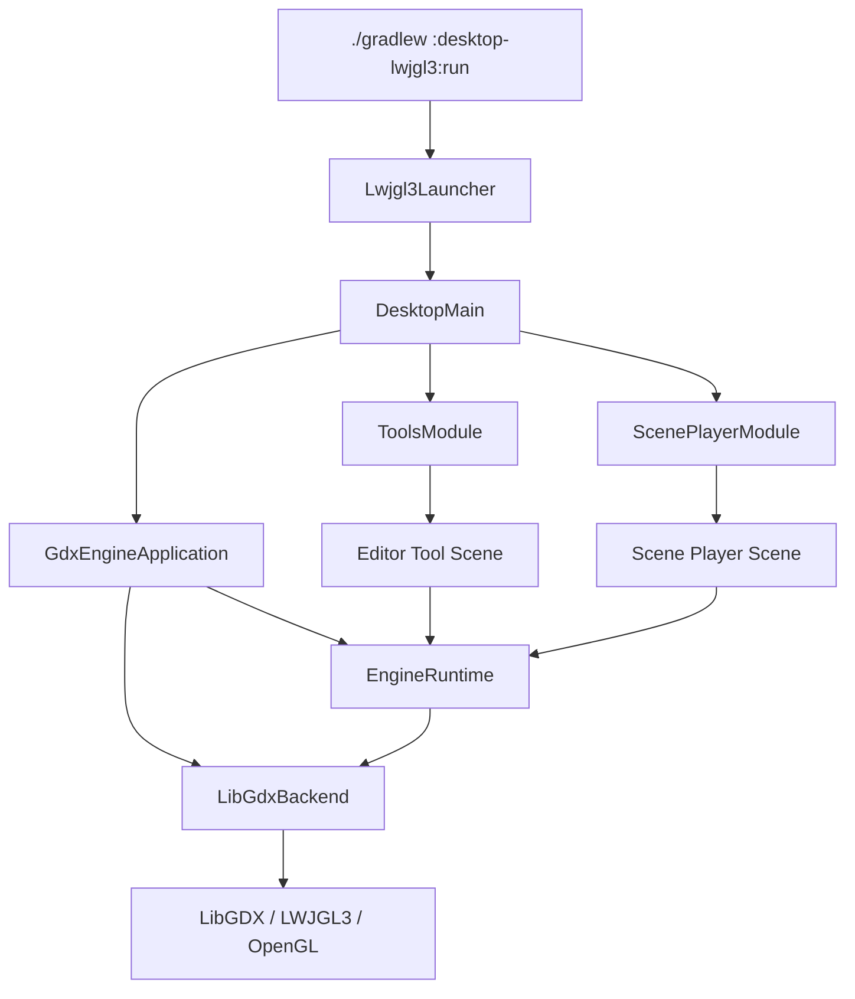

# KRender Desktop LWJGL3 Host

`desktop-lwjgl3` is the desktop host application for the KRender SDK. It creates the desktop LibGDX/LWJGL3 window and composes the SDK tools and scene player routes.

## Purpose

- This module is the runnable desktop application and launcher for the SDK.
- It is not the reusable engine backend.
- The concrete backend implementation lives in `engine:backend-gdx`.
- This module wires the backend and route modules into a desktop app entry point.

## Responsibilities

- Create the LWJGL3 desktop application window.
- Configure desktop startup and native-access JVM arguments.
- Start `GdxEngineApplication`.
- Compose `ToolsModule`.
- Compose `ScenePlayerModule`.
- Route the initial scene from `krender.scene`.
- Forward supported Gradle project properties into JVM system properties.
- Launch editor tools and runtime previews as separate JVM processes.

## Non-goals

- It does not define the engine API.
- It does not own the reusable backend implementation.
- It does not contain editor tool business logic.
- It does not contain scene-player runtime logic.
- It does not contain gameplay modules.

## Technologies

- Kotlin/JVM
- LibGDX LWJGL3 backend
- `gdx-backend-lwjgl3`
- `gdx-platform:natives-desktop`
- Gradle `application` plugin
- Separate JVM process launching for tool/runtime windows

## Dependencies

```text
desktop-lwjgl3
  -> core
  -> engine:backend-gdx
  -> engine:tools
  -> engine:scene-player
  -> LibGDX LWJGL3 backend libraries
```

- `core` provides the backend-neutral runtime API and shared services.
- `engine:backend-gdx` provides `GdxEngineApplication` and the concrete LibGDX backend wiring.
- `engine:tools` provides editor and development tool routes.
- `engine:scene-player` provides `.krscene` playback routes.

## Runtime Flow



## Routes

- Default desktop route is the Asset Browser when `krender.scene` is unset.
- `asset-browser`
- `model-viewer`
- `animation-viewer`
- `terrain-editor`
- `scene-editor`
- `ui-composer`
- `scene-player`
- `scene-viewer`
- `runtime-scene` legacy alias

Route selection is controlled by `krender.scene`.

## Run Examples

```sh
./gradlew :desktop-lwjgl3:run
./gradlew :desktop-lwjgl3:run -Pkrender.scene=asset-browser
./gradlew :desktop-lwjgl3:run -Pkrender.scene=model-viewer -Pkrender.model.path=model/wool_boy_animated.glb
./gradlew :desktop-lwjgl3:run -Pkrender.scene=scene-player -Pkrender.scene.path=scenes/example.krscene
```

## Source Layout

```text
desktop-lwjgl3/
  build.gradle.kts
  README.md
  nativeimage.gradle.kts
  src/main/kotlin/com/pashkd/krender/lwjgl3/
    Lwjgl3Launcher.kt
    DesktopMain.kt
    Lwjgl3EditorToolLauncher.kt
    Lwjgl3RuntimeWindowLauncher.kt
    Lwjgl3JvmProcessLauncher.kt
    StartupHelper.kt
```

## Validation

```sh
./gradlew :desktop-lwjgl3:compileKotlin
./gradlew :desktop-lwjgl3:run
./gradlew :core:compileKotlin :engine:backend-gdx:compileKotlin :engine:tools:compileKotlin :engine:scene-player:compileKotlin :desktop-lwjgl3:compileKotlin
./gradlew :core:test :engine:scene-player:test
```
