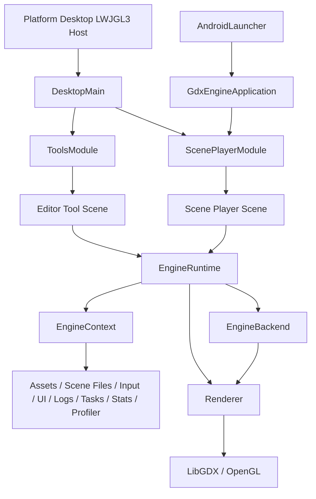

# Architecture

KRender SDK is organized as a small engine workspace rather than a single libGDX game application. The key architectural rule is a backend-neutral core with a separate LibGDX backend layer.

## High-Level Structure

- `core` contains the backend-neutral engine API, shared services, asset abstractions, scene serialization, terrain runtime, and UI contracts.
- `engine:backend-gdx` contains the concrete LibGDX runtime implementation and owns `Gdx.*`, OpenGL, and `gdx-gltf` integration.
- `engine:scene-player` contains the `.krscene` runtime playback route.
- `engine:tools` contains the standalone editor and inspection tools.
- `desktop-lwjgl3-win`, `desktop-lwjgl3-macos`, and `desktop-lwjgl3-linux` contain the platform desktop host applications.
- `android` contains the Android launcher.
- `games:woolboy` and `apps:woolboy-desktop` demonstrate how a standalone client app is built on top of the SDK.

## Core Runtime Concepts

- `EngineRuntime` owns the scene manager, game loop, runtime UI service, and shared engine services.
- `EngineContext` is the service facade passed into scenes and systems.
- `Scene` is the lifecycle container for world state, systems, render commands, assets, and window/viewport preferences.
- `SceneWorld` provides the ECS-style data model with entities, components, systems, and deferred world mutation.
- `RenderCommand` and `Renderer` separate gameplay/editor logic from backend rendering details.

## Scene and Update Flow

Scenes are activated through `scheduleAssets` and `show`, then updated through the fixed-step and per-frame loop. Asset loading continues asynchronously after activation, so scenes are expected to tolerate assets that are not ready yet.

The frame loop follows this broad structure:

1. start telemetry and the ImGui frame
2. process input and queued tasks
3. advance asset loading
4. apply pending scene transitions
5. run fixed updates, update, and late update
6. close the UI frame
7. collect render commands and submit them to the backend renderer
8. render runtime UI and editor UI

## Backend Boundary

Only `engine:backend-gdx` should talk directly to platform rendering APIs. Core logic, tools, and gameplay code should work through neutral interfaces such as:

- `AssetService`
- `Renderer`
- `InputService`
- `TaskService`
- `WindowService`
- `RuntimeUiService`

This keeps the engine code reusable and prevents LibGDX details from leaking into gameplay and editor logic.

## Runtime and Tooling

KRender ships both runtime playback and editor tooling:

- `scene-player` is the runtime route for `.krscene` files.
- editor tools are launched as standalone scenes through the desktop host applications.
- the Asset Browser can route assets into the correct editor or into runtime preview.

## Sample Application

Woolboy is packaged as a separate sample client app rather than an in-core sandbox scene. That split demonstrates the intended use of KRender as an SDK with standalone game/app modules on top.

---

## Runtime Architecture

KRender is organized around a small backend-facing runtime core:



`EngineRuntime` owns the game loop and exposes backend services through `EngineContext`. Scenes and systems use the
context instead of directly constructing backend services.

## Engine Components

| Component                | Responsibility                                                                                                                                                                   | Location                                                      |
|--------------------------|----------------------------------------------------------------------------------------------------------------------------------------------------------------------------------|---------------------------------------------------------------|
| `EngineRuntime`          | Starts the runtime, owns `SceneManager`, advances frames, resizes, disposes services, and exposes `EngineContext`.                                                               | `engine/api/EngineRuntime.kt`                                 |
| `EngineContext`          | Stable facade for scenes and systems to access scenes, assets, scene files, runtime/tool launchers, input, UI, events, logging, logs, stats, profiler, tasks, and exit requests. | `engine/api/EngineRuntime.kt`                                 |
| `EngineBackend`          | Backend contract implemented by platform/runtime integrations.                                                                                                                   | `engine/api/EngineRuntime.kt`                                 |
| `SceneManager`           | Deferred scene stack transitions and scene activation/disposal.                                                                                                                  | `engine/api/Scene.kt`                                         |
| `Scene`                  | Base runtime scene with `world`, required assets, lifecycle hooks, and ECS forwarding.                                                                                           | `engine/api/Scene.kt`                                         |
| `SceneWorld`             | Entity storage, system pipeline, deferred mutation buffer, render command buffer, and typed queries.                                                                             | `engine/api/Ecs.kt`                                           |
| `Entity` / `Component`   | Runtime data model. Components include `TransformComponent`, `NameComponent`, `ParentComponent`, `VelocityComponent`, `LifetimeComponent`, and domain-specific components.       | `engine/api/Ecs.kt`                                           |
| `System`                 | Behavior unit with `onAdded`, `fixedUpdate`, `update`, `lateUpdate`, `render`, and `debugRender`.                                                                                | `engine/api/Ecs.kt`                                           |
| `AssetService`           | Schedules, updates, checks, inspects, previews, and unloads typed assets.                                                                                                        | `engine/api/Assets.kt`, `engine/backend-gdx/.../LibGdxBackend.kt` |
| `InputService`           | Frame-stable normalized input snapshots and cursor capture.                                                                                                                      | `engine/api/Input.kt`, `engine/backend-gdx/.../LibGdxBackend.kt`  |
| `UiService` / `UiSystem` | ImGui frame lifecycle, capture state, panel drawing, and texture preview drawing.                                                                                                | `engine/ui/editor/Ui.kt`, `engine/backend-gdx/.../GdxImGuiService.kt`    |
| `Logger` / `LogService`  | Structured log entries, levels, history, sinks, and panels.                                                                                                                      | `engine/api/Debug.kt`, `engine/ui/editor/LogsPanel.kt`               |
| `TaskService`            | Coroutine-based background, IO, main/render queue, and in-flight job tracking.                                                                                                   | `engine/api/Tasks.kt`, `engine/backend-gdx/.../LibGdxBackend.kt`  |
| `Renderer`               | Backend render submission for collected `RenderCommand` instances.                                                                                                               | `engine/api/Render.kt`, `engine/backend-gdx/.../LibGdxBackend.kt` |
| `SceneSerializer`        | Encodes and decodes `.krscene` scene descriptors and applies them to `SceneWorld`.                                                                                               | `engine/scene/SceneSerializer.kt`                             |

## Scene Lifecycle

The base `Scene` has lifecycle hooks for asset scheduling, showing, updating, rendering, resizing, hiding, and
disposal.
The `SceneManager` defers scene transitions until the end of the current frame to avoid mid-frame state changes.
Effective activation is `scheduleAssets` then `show`; assets keep loading asynchronously afterwards, so scenes must
tolerate assets that are not ready yet.

```kotlin
open fun scheduleAssets(assets: AssetService)
open fun show()
open fun fixedUpdate(dt: Float)
open fun update(dt: Float)
open fun lateUpdate(dt: Float)
open fun render(alpha: Float)
open fun debugRender()
open fun resize(width: Int, height: Int)
open fun hide()
open fun dispose()
```

## Game Loop

`GdxEngineApplication.render()` calls `EngineRuntime.renderFrame(Gdx.graphics.deltaTime)`. `GameLoop` clamps large frame
deltas with `EngineConfig.maxFrameDeltaSeconds` and runs a fixed-step accumulator using
`EngineConfig.fixedStepSeconds` (`1 / 60f` by default).

Current frame order:

1. Begin runtime stats and profiler collection for the frame.
2. Begin the ImGui frame.
3. Process input and capture the current input state.
4. Execute pending main-thread tasks.
5. Advance asset loading.
6. Apply pending scene transitions and resize if needed.
7. Run fixed updates if required.
8. Run the main scene update.
9. Run late update logic.
10. Update runtime UI.
11. End the ImGui frame.
12. Collect render and debug render commands from the active scene.
13. Submit the render context to the backend renderer.
14. Run scene overlay rendering.
15. Render runtime UI, then render editor UI.

Simplified pseudocode:

```kotlin
backend.runtimeStats.beginFrame()
backend.profiler.beginFrame(frame)
backend.ui.beginFrame(delta)
backend.input.beginFrame()
backend.input.snapshot()
backend.tasks.flushMainThreadQueue()
backend.assets.update()

runtime.scenes.applyPendingTransitions(runtime)
val scene = runtime.scenes.currentScene ?: return

while (accumulator >= fixedStep) {
    scene.fixedUpdate(fixedStep)
    accumulator -= fixedStep
}

scene.update(delta)
scene.lateUpdate(delta)
runtime.runtimeUi.update(delta)

backend.ui.endFrame()
scene.render(alpha)
scene.debugRender()

backend.renderer.render(
    RenderContext(scene, alpha, delta, scene.world.renderCommands.snapshot())
)

scene.overlayRender()
runtime.runtimeUi.render()
backend.ui.render()
backend.input.endFrame()
backend.runtimeStats.endFrame(delta, fixedUpdates)
backend.profiler.endFrame(frame)
```

## Logging

Logging is implemented in `engine/api/Debug.kt`.

Current types:

- `LogLevel`: `Trace`, `Debug`, `Info`, `Warn`, `Error`.
- `LogEntry`: structured log event with level, tag, message, frame, thread name, timestamp, and optional error.
- `Logger`: lazy message API with `trace`, `debug`, `info`, `warn`, and `error`.
- `LogService`: in-memory recent log history with `minLevel`, clear, sink registration, and sink removal.
- `EngineLogService`: default in-memory implementation and logger.
- `LogSink`: sink abstraction.
- `GdxAppLogSink`: mirrors structured logs to LibGDX application logging.
- `FileLogSink`: writes session-scoped log files under `logs/` relative to the current working directory.
- `LogsPanel`: ImGui panel used by Asset Browser, Model Viewer, Animation Viewer, Terrain Editor, Scene Editor, and UI Composer.

`LibGdxBackend` creates one `EngineLogService`, exposes it as both `logger` and `logs`, and registers the LibGDX and
file sinks.

Example:

```kotlin
engine.logger.info("MyScene") { "Scene started with ${world.all().size} entities" }
engine.logger.warn("Assets") { "Asset metadata is not available yet" }
engine.logger.error("Runtime", error) { "Failed to load scene: ${error.message}" }
```

## Example: Creating a Custom System

Systems are added to `SceneWorld.systems` and receive the world plus phase timing. Use constructor injection for
services such as `Logger`, `InputService`, or `AssetService`.

```kotlin
import com.pashkd.krender.engine.api.Logger
import com.pashkd.krender.engine.api.SceneWorld
import com.pashkd.krender.engine.api.System
import com.pashkd.krender.engine.api.TransformComponent
import com.pashkd.krender.engine.api.VelocityComponent

class VelocitySystem(
    private val logger: Logger,
) : System() {
    override fun onAdded(world: SceneWorld) {
        logger.debug(TAG) { "VelocitySystem added to world with ${world.all().size} entities" }
    }

    override fun fixedUpdate(world: SceneWorld, dt: Float) {
        world.query<TransformComponent, VelocityComponent>().forEach { entity ->
            val transform = entity.get<TransformComponent>() ?: return@forEach
            val velocity = entity.get<VelocityComponent>() ?: return@forEach

            transform.position.x += velocity.value.x * dt
            transform.position.y += velocity.value.y * dt
            transform.position.z += velocity.value.z * dt
        }
    }

    companion object {
        private const val TAG = "VelocitySystem"
    }
}
```
