# KRender Engine Tools

`engine:tools` contains KRender's standalone editor and development tools. These tools are built on top of the shared engine/runtime services in `core` and are launched through the platform desktop host modules.

Dependency direction:

```text
engine:tools -> core
```

`engine:tools` is intended to stay backend-neutral editor/tool logic. It currently carries a small temporary
GDX dependency for explicitly allowlisted editor-preview adapters (`TerrainMaterialPreviewBaker`,
`textureatlaseditor/gdx/*`, `skin/gdx/*`, and `uicomposer/gdx/*`). Do not add new GDX imports casually; justify any exception in `BackendBoundaryTest`.
The preferred follow-up is to move this adapter layer to a dedicated module such as `engine:tools-gdx`.

Tool routes are selected with `krender.scene`. When running through `:desktop-lwjgl3-win:run`, `:desktop-lwjgl3-macos:run`, or `:desktop-lwjgl3-linux:run`, pass route properties with Gradle `-P` flags; the launcher forwards supported properties to JVM system properties. Asset paths are relative to the `assets/` working directory unless the current launcher documents otherwise.

Convenience launch scripts are available in `engine/tools/scripts/`:

- `asset_browser_launcher.sh` launches the Asset Browser.
- `model_viewer_launcher.sh [model/path.glb]` launches the Model Viewer, defaulting to `model/wool_boy_animated.glb`.
- `animation_viewer_launcher.sh [model/path.glb]` launches the Animation Viewer, defaulting to `model/wool_boy_animated.glb`.
- `terrain_editor_launcher.sh [terrains/file.json]` launches the Terrain Editor, defaulting to `terrains/terrain_02_small_flat.json`.
- `scene_editor_launcher.sh [scenes/file.krscene]` launches the Scene Editor, optionally opening a scene file.
- `ui_composer_launcher.sh [ui/scenes/file.krui]` launches the UI Composer, defaulting to `ui/scenes/test_scene_01.krui`.

## Tools

### Asset Browser

The Asset Browser is the default desktop tool. It scans project assets, maintains metadata, supports create/import/rename/duplicate/delete flows, and routes assets to the right editor or runtime preview path.

Features:

- Scans configured local asset directories and stores stable asset metadata in `.krmeta` sidecars.
- Detects model, texture, skybox, material, terrain, scene, UI scene, and Scene2D Skin assets.
- Groups unsupported files under the `Other` category so they remain visible without being treated as editable engine
  assets.
- Supports category filters, search with quick clear, list-only asset browsing, and sorting by name, type, modified
  time, or size.
- Shows asset path and file size directly in the asset list.
- Shows base asset information and focused metadata panels for models, textures, terrains, scenes, UI scenes, and
  Scene2D Skin JSON descriptors.
- Renders texture previews in Asset Details through the shared backend texture preview path.
- Indexes LibGDX Scene2D Skin JSON files under `ui/skins/` and extracts lightweight style metadata without creating a
  LibGDX `Skin` or requiring an OpenGL context during scanning.
- Opens assets with registered tools:
    - models in Model Viewer or Animation Viewer;
    - terrains in Terrain Editor;
    - `.krscene` files in Scene Editor or Runtime;
    - `.krui` files in UI Composer.
- Provides context menu operations for opening, opening with a specific tool, renaming, duplicating, deleting, and
  revealing files.
- Provides a focused Create Asset dialog for `UI Scene`, `Terrain`, and `Scene` assets only.
- Lets new `.krui` UI scenes select a discovered Scene2D Skin path while keeping the `.krui` schema path-based.
- Shows a draft preview in the Create Asset dialog with final file path, existence state, and default parameters before
  creation.
- Keeps managed asset files and `.krmeta` sidecars in sync during create, rename, duplicate, and delete operations.
- Keeps visible-only `Other` files indexed without promoting them into managed assets or creating `.krmeta`.
- Deletes Scene2D Skin assets as a folder-scoped operation when they live under `ui/skins/<skinFolder>/...`: the skin
  JSON, its `.krmeta`, and dependency files in that direct skin folder are removed together. Rename and duplicate are
  currently disabled for Scene2D Skin assets to avoid partial folder operations.
- Keeps layout controls in the Asset Browser Controls panel, including Create Asset, Import Asset, Export Asset
  placeholder, Persist UI, and Reset UI.

Import workflow:

- Supported imports: textures (`.png`, `.jpg`, `.jpeg`, `.webp`), binary glTF models (`.glb`), and Scene2D Skin JSON
  files. `.gltf` and `.obj` are detected by the browser, but import is not supported yet.
- Import destinations: textures go to `textures/`, `.glb` files go to `model/`, and Scene2D Skin JSON files go to
  `ui/skins/<skinFolder>/`.
- Scene2D Skin import copies the main JSON into its own skin folder and also copies same-folder dependencies such as
  `.atlas`, `.png`, `.jpg`, `.jpeg`, `.webp`, `.fnt`, `.ttf`, and `.otf`, plus dependency files referenced from the
  skin JSON.
- Collision policies: `Overwrite`, `Rename`, and `Skip`. `Overwrite` asks for confirmation when the main target
  already exists, `Rename` picks a unique target path, and `Skip` leaves the existing target untouched.
- Imported managed assets receive `.krmeta` sidecars. Visible-only `Other` files remain visible in Asset Browser but do
  not receive `.krmeta`.
- Deleting a Scene2D Skin imported into `ui/skins/<skinFolder>/` removes the entire direct skin folder and all
  dependencies stored inside it.

Screenshots:

Asset Browser Overview

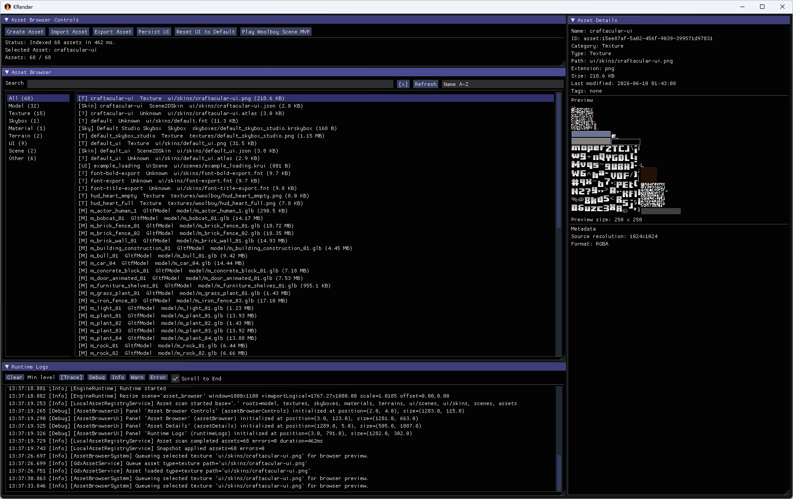

Asset Metadata Panels

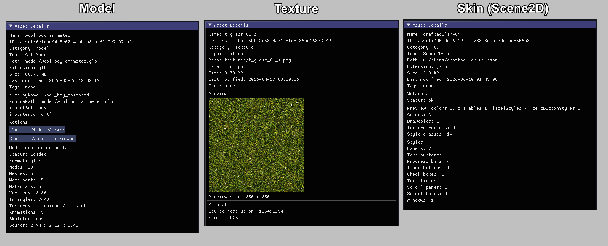

Create Asset Dialog


Open With Context Menu


Required properties:

- `krender.scene=asset-browser`

Example:

```sh
./gradlew :desktop-lwjgl3-linux:run -Pkrender.scene=asset-browser
```

### Model Viewer

The Model Viewer is a focused single-model inspection tool. It exposes mesh parts, materials, texture-channel debug modes, UV checker previews, bounds, grid/axis helpers, wireframe, and glTF-oriented preview rendering.

Features:

- Opens model assets directly from Asset Browser or from a provided model path.
- Provides editor-style camera controls for orbiting, panning, zooming, and framing the model.
- Supports common viewport helpers such as grid, axes, bounding boxes, and wireframe overlays.
- Displays general model information such as format, bounds, mesh count, material count, vertices, and triangle count.
- Shows mesh parts, materials, texture channels, and animation metadata when available.
- Allows selecting and isolating individual mesh parts for easier inspection.
- Allows filtering mesh parts by selected material to inspect how geometry maps to material assignments.
- Provides shaded, wireframe, and mixed shaded-wireframe display modes.
- Provides a renderer selector with `LibGDX / Legacy` and `glTF / PBR` modes, with glTF / PBR as the default renderer path.
- Uses the `gdx-gltf` renderer path for `.gltf` and `.glb` models in `glTF / PBR` mode.
- Includes viewport controls grouped into camera, shared display options, renderer selection, and renderer-specific options.
- Includes `glTF / PBR` controls for environment preset, skybox visibility, environment intensity, exposure, rotation, and directional light settings.
- Uses HDR environment manifests under `assets/hdr/<environment>/environment.json`, including generated skybox, irradiance, radiance, and shared BRDF LUT assets.
- Provides channel-display modes separate from shared viewport display modes.
- Can preview Base Color / Diffuse, Normal, Metallic / Roughness, Occlusion, Emission, and Alpha texture channels directly on the model surface when metadata is available.
- Includes UV checker preview using texture assets at 1024, 2048, and 4096 resolutions for validating UV layout and scale.
- Gives texture debug modes priority over PBR rendering, so material inspection stays stable when both features are
  available.
- Falls back safely and reports warnings when a model has no UVs or a requested texture channel is unavailable.
- Falls back safely and reports warnings when glTF / PBR rendering is unavailable for a model or when optional skybox/IBL
  resources cannot be created on the active graphics backend.
- Shows texture previews when supported by the backend.
- Includes loading state, logs, and viewport layout controls.

Screenshots:

Primary renderer view:


Viewport display options, helpers, wireframe, and renderer switching:


Normal channel preview:


Metallic and roughness channel preview in PBR mode:


Ambient occlusion channel preview:


Alpha / transparency preview:


Mesh-part and material isolation workflow:


Required properties:

- `krender.scene=model-viewer`
- `krender.model.path=<path>`

Example:

```sh
./gradlew :desktop-lwjgl3-linux:run -Pkrender.scene=model-viewer -Pkrender.model.path=model/example.glb
```

### Animation Viewer

The Animation Viewer is a playback and rig-inspection tool for animated models. It provides clip selection, play/pause/loop/scrub controls, skeleton hierarchy browsing, pose overlays, and model/skeleton combined preview modes.
Features:

- Opens model assets directly from Asset Browser or from a provided model path.
- Loads and displays a single model using the same editor-style viewport/camera workflow as the existing viewer tools.
- Provides viewer toolbar actions for saving and resetting the UI layout, resetting the camera, framing the model, and exiting the tool.
- Supports common viewport helpers such as grid, axes, bounding boxes, wireframe rendering, configurable grid size, and ambient light intensity control.
- Shows available animation clip names, clip durations, and rig metadata such as skeleton presence, bone count, and bone-weight channel count.
- Allows selecting one animation clip for preview.
- Provides Play, Pause, Stop, playback speed, loop toggle, time scrub, and step controls for clip preview.
- Supports `Model`, `Skeleton`, and `Model + Skeleton` view modes.
- Draws a backend-neutral skeleton overlay using sampled parent-child pose lines when skeleton pose data is available.
- Includes a dedicated skeleton panel with hierarchy browsing, bone selection, connected-bone highlighting, optional joint markers, and current sampled bone pose details.
- Shows preview capability status such as `Animation preview: requested`, `available`, `metadata only`, or `unsupported`, and also reports skeleton preview support.
- Surfaces clear warnings when animation duration is unknown, when skeleton pose data is unavailable for the current
  model/backend, or when preview support is limited.
- Includes loading and runtime log panels for inspection and debugging while the asset is being prepared.
- Includes ambient light intensity controls to make motion and poses easier to inspect without introducing a more
  complex lighting rig.
- Falls back safely for static models, models without animation clips, and models where only partial animation metadata
  is available.

Current scope / limitations:

- The tool is currently an MVP viewer for clip and pose inspection.
- It does not implement a full animation graph, blending system, or gameplay animation state machine.
- Animation preview depends on the active backend exposing runtime metadata and preview support for the loaded model
  format.
- Some models may provide skeleton pose previews even when animation clip metadata is missing or incomplete.

Screenshots:


Required properties:

- `krender.scene=animation-viewer`
- `krender.model.path=<path>`

Example:

```sh
./gradlew :desktop-lwjgl3-linux:run -Pkrender.scene=animation-viewer -Pkrender.model.path=model/example.glb
```

### Terrain Editor

The Terrain Editor is the terrain authoring tool for KRender heightfields. It loads terrain files, supports sculpt/paint brushes, layer and material preview workflows, save/load, wireframe/stats views, and terrain-focused diagnostics.

Features:

- Create or load terrain assets.
- Configure terrain size and vertex spacing.
- Generate flat terrain, with extension points for noise-based generators.
- Edit terrain using brushes: raise, lower, flatten, smooth, and paint layer.
- Adjust brush radius, strength, falloff, and paint/erase behavior.
- Use undo and redo while editing terrain.
- Manage multiple terrain layers with materials, colors, visibility, tiling, and order.
- Preview terrain using layer colors, material colors, textures, or selected layer masks.
- Save and load terrain data.
- View mesh statistics, hover position, selected layer, preview state, and logs.

Screenshots:


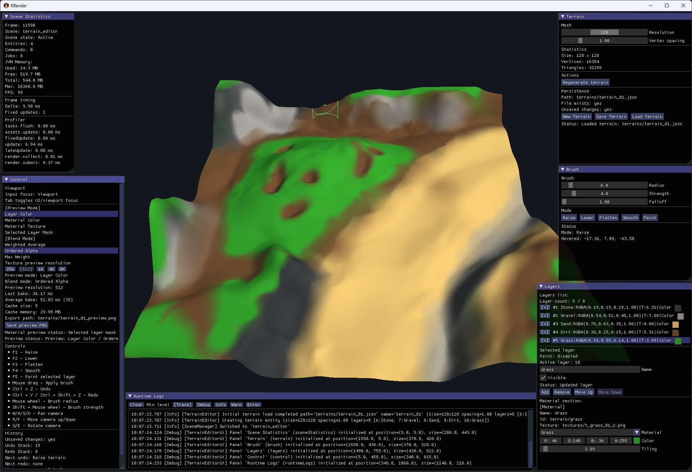


Required properties:

- `krender.scene=terrain-editor`
- `krender.terrain.path=<path>`

Example:

```sh
./gradlew :desktop-lwjgl3-linux:run -Pkrender.scene=terrain-editor -Pkrender.terrain.path=terrain/example.krterrain
```

### Scene Editor

The Scene Editor is the `.krscene` authoring tool. It supports hierarchy and inspector workflows, asset placement, selection, transforms, camera/light setup, editor gizmos, and launching a saved scene into the runtime player.
It is currently an MVP editor focused on the core scene-building workflow: placing assets, editing transforms, configuring cameras and lights, selecting objects, and running the scene in a separate runtime window.

Features:

- Create new scene files with default camera and light setup.
- Open, save, and save-as `.krscene` documents.
- Place model and terrain assets into the scene.
- Create empty entities, cameras, directional lights, and point lights.
- Edit entity names, active state, transforms, cameras, and light properties.
- Select entities from the viewport.
- Use hierarchy, inspector, asset placement, toolbar, viewport, and logs panels.
- Configure active camera settings and align camera/view when needed.
- Configure scene lighting, including ambient light, directional lights, and point lights.
- Render scene models and terrain assets in the editor viewport.
- Display editor helpers such as grid, axes, selected bounds, and light gizmos.
- Launch the saved scene in a separate runtime window for preview.

Screenshots:


Required properties:

- `krender.scene=scene-editor`

Optional properties:

- `krender.scene.path=<path>`
- `krender.scene.name=<name>`

Example:

```sh
./gradlew :desktop-lwjgl3-linux:run -Pkrender.scene=scene-editor -Pkrender.scene.path=scenes/example.krscene
```

### UI Composer

The UI Composer is the `.krui` document editor and preview tool. Its current scope covers validation, Scene2D preview, selected-node scalar editing, hierarchy-driven structure editing, save, undo/redo, hierarchy or canvas selection, Skin-backed style/background picking, and Asset Registry-backed Image texture picking. It remains a document-oriented workflow rather than a full drag/drop UI authoring suite.

Screenshots:

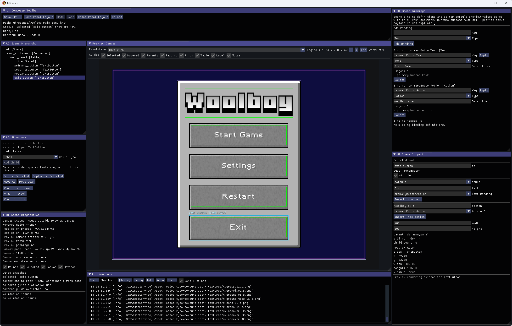
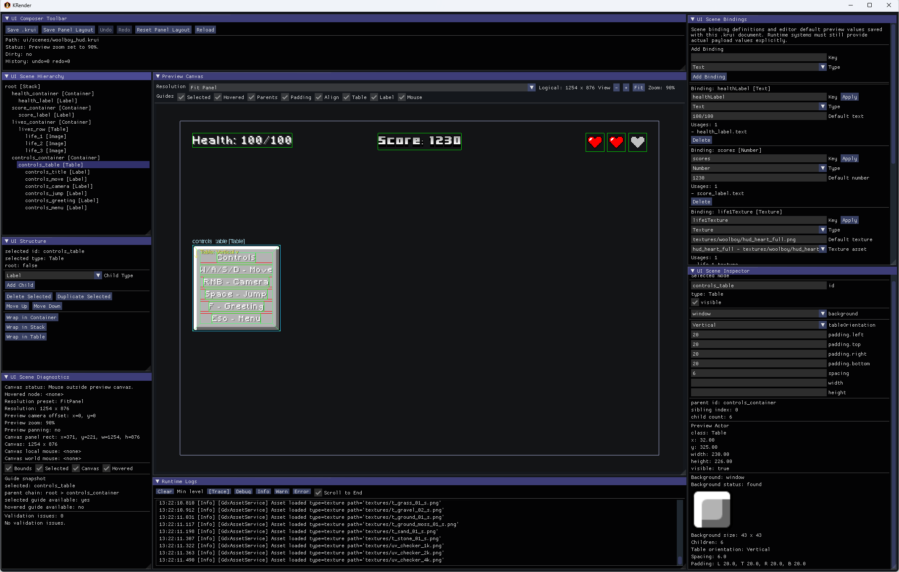
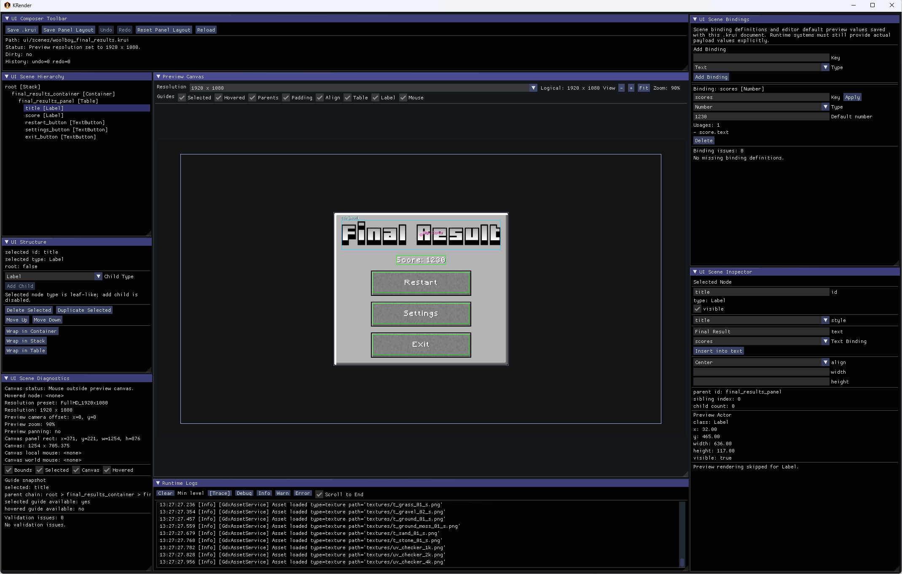

Required properties:

- `krender.scene=ui-composer`
- `krender.ui.scene.path=<path>`

Example:

```sh
./gradlew :desktop-lwjgl3-linux:run -Pkrender.scene=ui-composer -Pkrender.ui.scene.path=ui/example.krui
```

### Skin Editor

The Skin Editor is a standalone Scene2D Skin inspection and editing tool for LibGDX/Scene2D skin JSON and `.uiskin` assets. It is focused on inspecting styles, resources, diagnostics, atlas regions, fonts, colors, and preview widgets, while also supporting draft style/resource editing and saving those edits back to the loaded skin file.

Supported files and assets:

- Scene2D skin `.json`
- Scene2D skin `.uiskin`
- Same-folder dependencies such as `.atlas`, `.png`, `.jpg`, `.jpeg`, `.webp`, `.fnt`, `.ttf`, and `.otf`
- Imported or discovered skins under `assets/ui/skins/...`

Major panels:

- Skin Editor Control
  Reload, Discard Edits, Save Changes, Save/Reset Panel Layout, status, path, and dirty state.
- Styles
  Style tree grouped by Scene2D style type with counts and selected-style navigation.
- Style Inspector
  Selected style details, editable fields, field add/remove/reset, create/duplicate/rename/delete style actions, and pending changes.
- Resources
  Resource search/filtering, category browsing, selected resource details, and resource preview.
- Problems
  Diagnostics/validation issues with severity/category filtering and selection links to related style/resource context.
- Preview Canvas
  Scene2D widget preview with screen preset, scale, preview zoom mode, Fit/Reset Camera controls, checkerboard, bounds, selected-style highlight, and widget interaction.
- Preview Controls
  Widget layout presets, preview text samples, and fallback warning controls.

Main features:

- Load and reload Scene2D skin descriptors.
- Index styles and resources without requiring manual JSON inspection.
- Browse styles by Scene2D type and name.
- Browse resources with search and category filters.
- Inspect style fields and resource references.
- Diagnose missing resources, invalid references, duplicate resources, color/font/atlas issues, and unused resources.
- Preview common widgets using the current skin.
- Preview the selected style inside the Scene2D canvas.
- Interact with Scene2D widgets in the Preview Canvas using `LMB`.
- Pan the preview camera with `Ctrl + RMB drag`.
- Zoom the preview camera with `Ctrl + mouse wheel`.
- Use `Fit`, `Reset Camera`, and the `Zoom Mode` selector to navigate the preview consistently with the atlas/font editors.
- Toggle Scene2D bounds, selected-style highlight, and preview checkerboard.
- Preview atlas and texture resources.
- Use an interactive atlas viewport with pan/zoom, click-to-select atlas region, checkerboard, grid, all-region bounds, hover highlight, and region selection.
- Preview bitmap fonts with editable sample text.
- Preview color resources.
- Use an in-memory edit workflow for field edits, add/remove/reset field, color resource edits, create/duplicate/rename/delete style, and pending change review.
- Save draft style/resource edits back to the loaded skin JSON or `.uiskin` file.

#### Save workflow

- Edits remain draft/in-memory until `Save Changes`.
- `Save Changes` writes draft style/resource edits to the loaded skin file.
- A `.bak` backup is created beside the skin file before write.
- The backup is the latest-save backup and may be overwritten by subsequent saves.
- After a successful save, the tool reloads the skin and the edit state becomes clean.
- `Save Panel Layout` is separate from `Save Changes`.
- `Discard Edits` discards in-memory draft changes only.

`Save Changes` does not save:

- panel layout state
- preview camera state
- atlas preview viewport state
- Scene2D widget interaction state
- atlas, texture, or font binary assets

#### Current scope / limitations

- Skin Editor is not a full Skin Composer replacement.
- It does not pack atlases.
- It does not create or edit texture regions.
- It does not edit bitmap font glyphs.
- It does not import external skin packages inside the tool.
- Keyboard text input inside the preview may still be limited.
- Saving may rewrite JSON in KRender pretty JSON format.

Required properties:

- `krender.scene=skin-editor`

Optional properties:

- `krender.skin.path=<path>`

Example:

```sh
./gradlew :desktop-lwjgl3-linux:run -Pkrender.scene=skin-editor -Pkrender.skin.path=ui/skins/xp_ui/xp-ui.json
```

If `krender.skin.path` is omitted, Skin Editor starts in an empty/no-skin state until a skin path is provided.

Screenshots:

_To be added._

### Bitmap Font Editor

The Bitmap Font Editor is a standalone tool for generating, previewing, and saving BitmapFont assets from TTF/OTF source fonts. It produces standard BMFont text `.fnt` descriptors with standalone `.png` page textures suitable for Scene2D runtime use.

Features:

- Open existing `.fnt` text BMFont descriptors and inspect glyphs, metrics, and kerning pairs.
- Create new Bitmap Font assets from Asset Browser (New → Bitmap Font).
- Choose a project-relative TTF/OTF source font with a file picker.
- Configure charset (English, Symbols, Ukrainian Cyrillic, Combined, Custom), font size, padding, spacing, and page dimensions.
- Configure AWT rasterizer options: text anti-aliasing mode, fractional metrics, render quality, stroke control.
- Preview the generated font page with glyph bounds overlay and sample text rendering with kerning.
- Pan/zoom canvas with fit, reset, focus-selected-glyph camera actions, checkerboard, and grid.
- Generate and save `.fnt` + `.png` + `.kfont.json`.
- Detect and reject binary BMFont files with a diagnostic message.

File write safety:

- **Preview** writes a transient PNG to a preview cache directory. It does not modify the project output files.
- **Generate** writes a preview PNG and updates the in-memory document. Marks the document dirty.
- **Save Font** is the explicit write action for `.fnt` + `.png` + `.kfont.json`.

Current limitations:

- No binary or XML BMFont support.
- Single page only — overflow is reported, multiple pages are not created.
- No manual glyph metrics editing or kerning generation.
- No SDF/MSDF font support.
- AWT rasterizer only — LibGDX FreeType is planned as a future production rasterizer.

Screenshots:

Full editor interface:
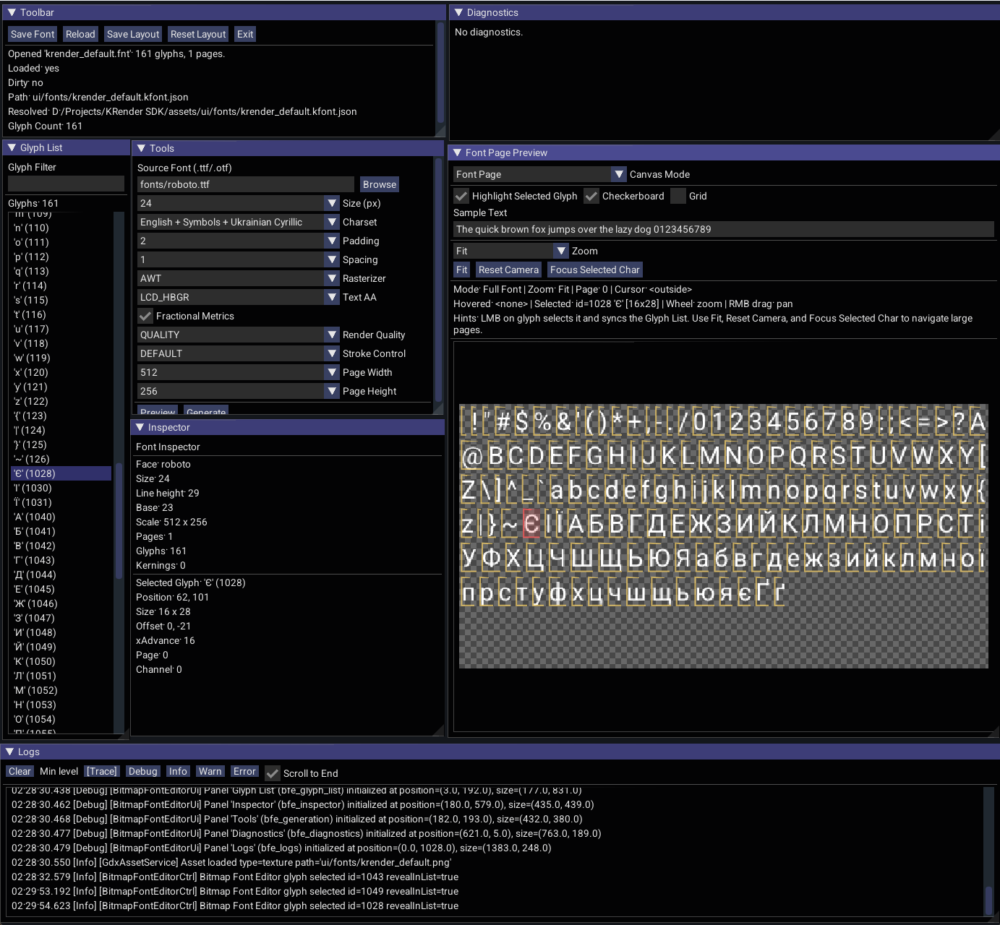

Preview canvas interactions and inspection flow:


Glyph List, Tools, and Inspector panels:
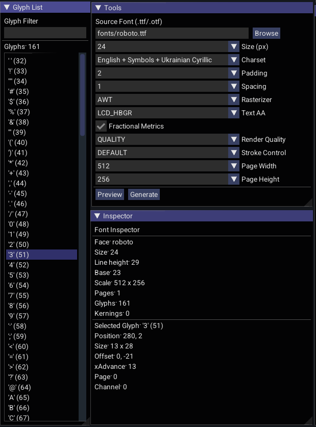

Required properties:

- `krender.scene=bitmap-font-editor`

Optional properties:

- `krender.font.path=<path>` — path to a `.fnt` or `.kfont.json` file to open on launch.

Detailed documentation: [Bitmap Font Editor](tools/bitmap_font_editor.md)

### Texture Atlas Editor

The Texture Atlas Editor is an atlas-centric tool for packing image, NinePatch, and BitmapFont resources into libGDX texture atlases. The opened `.atlas` file is the root working document.

Features:

- Open and preview existing `.atlas` files with page and region browsing.
- View a unified resource list of Image, NinePatch, and Font resources derived from atlas regions and discovered `.fnt` files.
- Import image textures from outside the asset root.
- Add existing image textures as packable resources.
- Import BitmapFont `.fnt` descriptors and their page textures next to the atlas.
- Create NinePatch resources from Image resources with interactive split/pad guide editing.
- Preview NinePatch stretch behavior at configurable target sizes (Actual, Button, Panel, Custom).
- Preview BitmapFont pages, glyph bounds, and sample text rendering.
- Pack all resources into an in-memory atlas layout with configurable page size, padding, and NinePatch inclusion.
- Preview the packed atlas output before saving.
- Explicitly save the packed atlas as `.atlas` descriptor + PNG page files.
- Optionally pack BitmapFont page images into the atlas. When enabled, a separate `*_packed.fnt` descriptor is written during save with atlas-relative glyph coordinates. The original imported `.fnt` is never modified.
- Export individual resources as standalone PNG or `.9.png` files.
- Rename and delete resources from the working draft.
- View diagnostics for atlas parsing, font parsing, NinePatch validation, and packing results.
- Pan, zoom, fit, and focus regions in the preview canvas. Toggle checkerboard, grid, bounds, and NinePatch guide overlays.

File write safety:

- **Pack Texture Atlas** is in-memory only and does not write files.
- **Save Texture Atlas** is the explicit write action for `.atlas` + PNG pages.
- **Add Font** is an explicit import action that copies `.fnt` + page PNGs next to the atlas.
- **Import Image** is an explicit file copy action.
- **Export Resource** is an explicit file write action.
- Preview, selection, canvas mode switching, and packing preview do not write files.
- The tool does not generate `.krmeta` files.

Current limitations:

- The packing algorithm is a shelf-based packer. MaxRects or other advanced strategies are not yet implemented.
- The `Allow Rotation` setting is accepted but not applied during packing.
- Multi-page BitmapFont packing is not supported. Fonts with more than one page are skipped with a diagnostic warning.
- BitmapFont generation from TTF/OTF is not part of Texture Atlas Editor. Font generation belongs to the [Bitmap Font Editor](tools/bitmap_font_editor.md).
- Sample text preview does not handle newlines.

Screenshots:

Full editor interface:
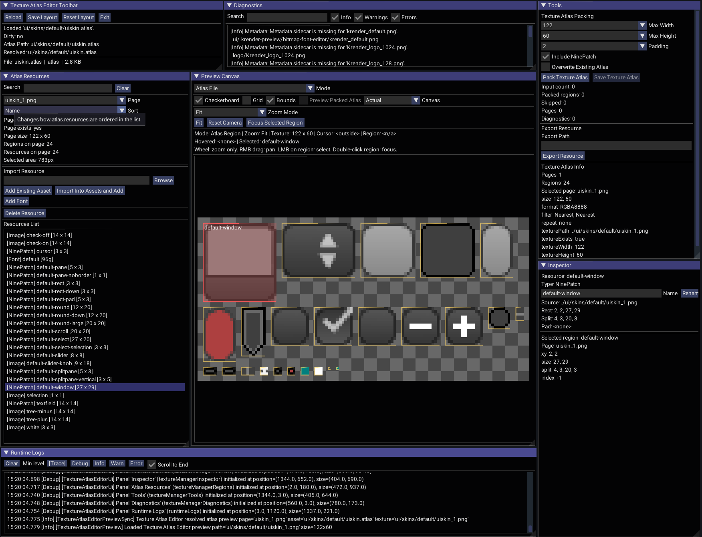

Atlas File preview controls:
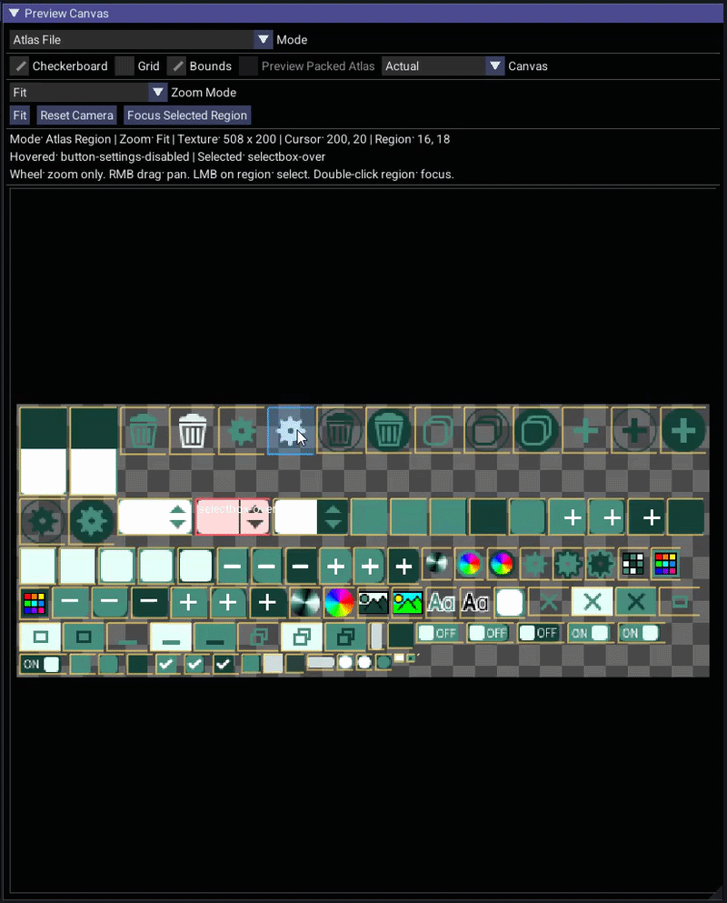

Font Preview controls:
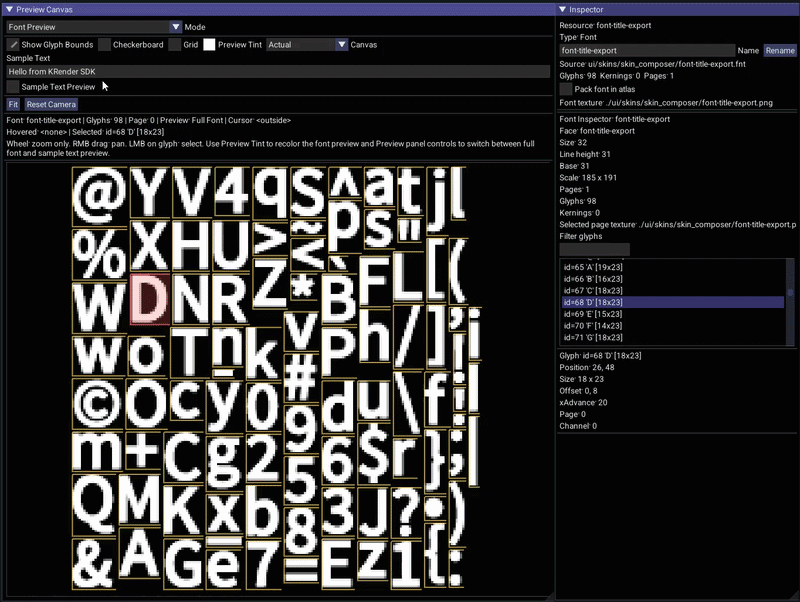

NinePatch Editor preview controls:
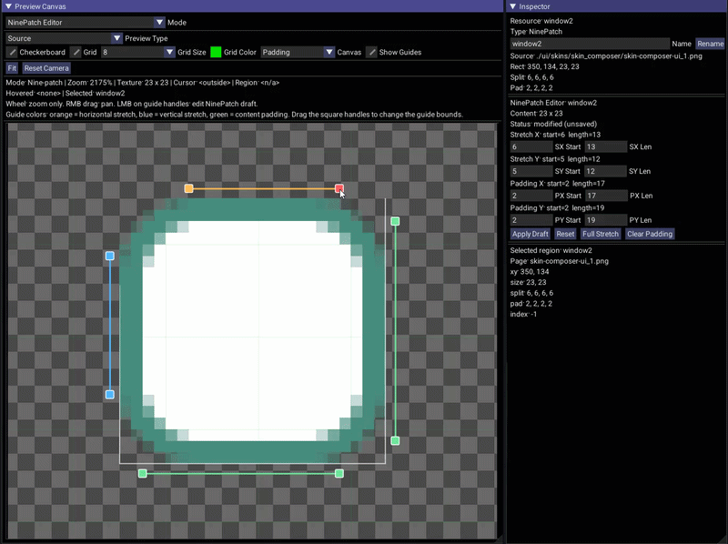

Resources panel:
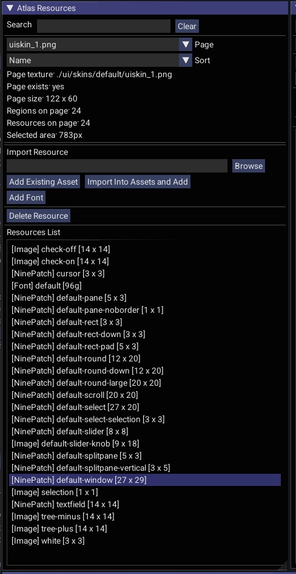

Tools panel:
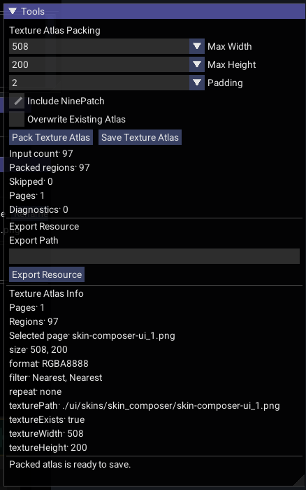

Required properties:

- `krender.scene=texture-atlas-editor`

Optional properties:

- `krender.atlas.path=<path>`

Example:

```sh
./gradlew :desktop-lwjgl3-linux:run -Pkrender.scene=texture-atlas-editor -Pkrender.atlas.path=ui/skins/default/uiskin.atlas
```

If `krender.atlas.path` is omitted, the tool starts in an empty state until an atlas path is provided.

## Related Route

### Scene Player

Scene Player is the runtime/player route for `.krscene` files. It is not an editor tool, but it is closely related because Scene Editor and Asset Browser can launch it for scene preview and playback.

Screenshot:


Route names:

- `scene-player` preferred route
- `scene-viewer`
- `runtime-scene` legacy alias

Required properties:

- `krender.scene=scene-player`
- `krender.scene.path=<path>`

Example:

```sh
./gradlew :desktop-lwjgl3-linux:run -Pkrender.scene=scene-player -Pkrender.scene.path=scenes/example.krscene
```

The legacy command still works:

```sh
./gradlew :desktop-lwjgl3-linux:run -Pkrender.scene=runtime-scene -Pkrender.scene.path=scenes/example.krscene
```

## IntelliJ IDEA

Run the SDK desktop host from IntelliJ IDEA:


Run the standalone Woolboy app from IntelliJ IDEA:


## Validation

Use these checks after changing tool code:

```sh
./gradlew :core:compileKotlin :engine:tools:compileKotlin :engine:scene-player:compileKotlin :desktop-lwjgl3-win:compileKotlin :desktop-lwjgl3-macos:compileKotlin :desktop-lwjgl3-linux:compileKotlin
./gradlew :core:test :engine:scene-player:test
```
