# KRender Engine Tools

`engine:tools` contains KRender's standalone editor and development tools. These tools are built on top of the shared engine/runtime services in `core` and are launched through the desktop `lwjgl3` application.

Dependency direction:

```text
engine:tools -> core
```

Tool routes are selected with `krender.scene`. When running through `:lwjgl3:run`, pass route properties with Gradle `-P` flags; the launcher forwards supported properties to JVM system properties. Asset paths are relative to the `assets/` working directory unless the current launcher documents otherwise.

## Tools

### Asset Browser

The Asset Browser is the default desktop tool. It scans project assets, maintains metadata, supports create/import/rename/duplicate/delete flows, and routes assets to the right editor or runtime preview path.

Features:

- Scans configured local asset directories and stores stable asset metadata in `.krmeta` sidecars.
- Detects model, texture, skybox, material, terrain, scene, UI scene, and Scene2D Skin assets.
- Groups unsupported files under the `Other` category so they remain visible without being treated as editable engine
  assets.
- Supports category filters, search with quick clear, list-only asset browsing, and sorting by name, type, modified
  time, or size.
- Shows asset path and file size directly in the asset list.
- Shows base asset information and focused metadata panels for models, textures, terrains, scenes, UI scenes, and
  Scene2D Skin JSON descriptors.
- Renders texture previews in Asset Details through the shared backend texture preview path.
- Indexes LibGDX Scene2D Skin JSON files under `ui/skins/` and extracts lightweight style metadata without creating a
  LibGDX `Skin` or requiring an OpenGL context during scanning.
- Opens assets with registered tools:
    - models in Model Viewer or Animation Viewer;
    - terrains in Terrain Editor;
    - `.krscene` files in Scene Editor or Runtime;
    - `.krui` files in UI Composer.
- Provides context menu operations for opening, opening with a specific tool, renaming, duplicating, deleting, and
  revealing files.
- Provides a focused Create Asset dialog for `UI Scene`, `Terrain`, and `Scene` assets only.
- Lets new `.krui` UI scenes select a discovered Scene2D Skin path while keeping the `.krui` schema path-based.
- Shows a draft preview in the Create Asset dialog with final file path, existence state, and default parameters before
  creation.
- Keeps managed asset files and `.krmeta` sidecars in sync during create, rename, duplicate, and delete operations.
- Keeps visible-only `Other` files indexed without promoting them into managed assets or creating `.krmeta`.
- Deletes Scene2D Skin assets as a folder-scoped operation when they live under `ui/skins/<skinFolder>/...`: the skin
  JSON, its `.krmeta`, and dependency files in that direct skin folder are removed together. Rename and duplicate are
  currently disabled for Scene2D Skin assets to avoid partial folder operations.
- Keeps layout controls in the Asset Browser Controls panel, including Create Asset, Import Asset, Export Asset
  placeholder, Persist UI, Reset UI, and a shortcut explaining that Woolboy now ships as a separate standalone app.

Import workflow:

- Supported imports: textures (`.png`, `.jpg`, `.jpeg`, `.webp`), binary glTF models (`.glb`), and Scene2D Skin JSON
  files. `.gltf` and `.obj` are detected by the browser, but import is not supported yet.
- Import destinations: textures go to `textures/`, `.glb` files go to `model/`, and Scene2D Skin JSON files go to
  `ui/skins/<skinFolder>/`.
- Scene2D Skin import copies the main JSON into its own skin folder and also copies same-folder dependencies such as
  `.atlas`, `.png`, `.jpg`, `.jpeg`, `.webp`, `.fnt`, `.ttf`, and `.otf`, plus dependency files referenced from the
  skin JSON.
- Collision policies: `Overwrite`, `Rename`, and `Skip`. `Overwrite` asks for confirmation when the main target
  already exists, `Rename` picks a unique target path, and `Skip` leaves the existing target untouched.
- Imported managed assets receive `.krmeta` sidecars. Visible-only `Other` files remain visible in Asset Browser but do
  not receive `.krmeta`.
- Deleting a Scene2D Skin imported into `ui/skins/<skinFolder>/` removes the entire direct skin folder and all
  dependencies stored inside it.

Screenshots:

Asset Browser Overview


Asset Metadata Panels


Create Asset Dialog

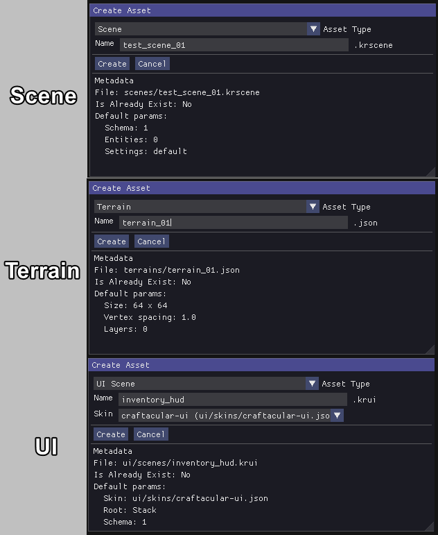

Open With Context Menu

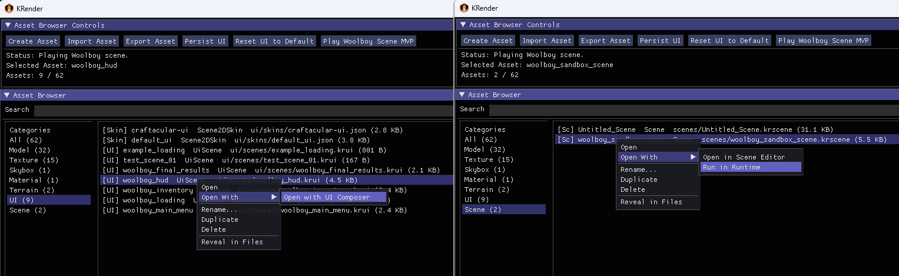


Required properties:

- `krender.scene=asset-browser`

Example:

```sh
./gradlew :lwjgl3:run -Pkrender.scene=asset-browser
```

### Model Viewer

The Model Viewer is a focused single-model inspection tool. It exposes mesh parts, materials, texture-channel debug modes, UV checker previews, bounds, grid/axis helpers, wireframe, and glTF-oriented preview rendering.

Features:

- Opens model assets directly from Asset Browser or from a provided model path.
- Provides editor-style camera controls for orbiting, panning, zooming, and framing the model.
- Supports common viewport helpers such as grid, axes, bounding boxes, and wireframe overlays.
- Displays general model information such as format, bounds, mesh count, material count, vertices, and triangle count.
- Shows mesh parts, materials, texture channels, and animation metadata when available.
- Allows selecting and isolating individual mesh parts for easier inspection.
- Provides shaded, wireframe, and mixed shaded-wireframe display modes.
- Provides a renderer selector with `LibGDX (default)` and `PBR` modes for comparing the default backend path with a
  glTF-focused PBR preview.
- Uses the `gdx-gltf` PBR rendering path for `.gltf` and `.glb` models in PBR mode.
- Includes PBR preview controls for exposure, environment intensity, skybox visibility, directional light enablement,
  light yaw, and light pitch.
- Uses a default cubemap skybox texture asset for PBR previews, stored as a single cubemap cross/strip texture file.
- Provides shader-based material debug preview modes separate from viewport display modes.
- Can preview Base Color / Diffuse, Normal, Metallic / Roughness, Occlusion, Emission, and Alpha texture channels directly on the model surface when metadata is available.
- Includes UV checker preview using texture assets at 1024, 2048, and 4096 resolutions for validating UV layout and scale.
- Gives texture debug modes priority over PBR rendering, so material inspection stays stable when both features are
  available.
- Falls back safely and reports warnings when a model has no UVs or a requested texture channel is unavailable.
- Falls back safely and reports warnings when PBR preview is unavailable for a model or when optional skybox/IBL
  resources cannot be created on the active graphics backend.
- Shows texture previews when supported by the backend.
- Includes loading state, logs, and viewport layout controls.

Screenshots:


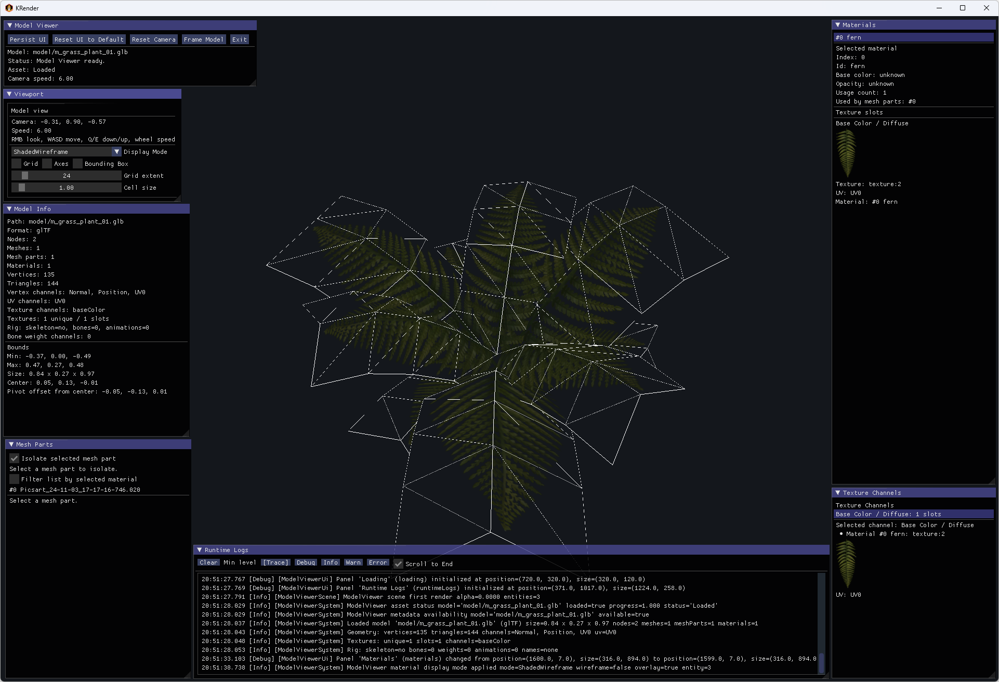
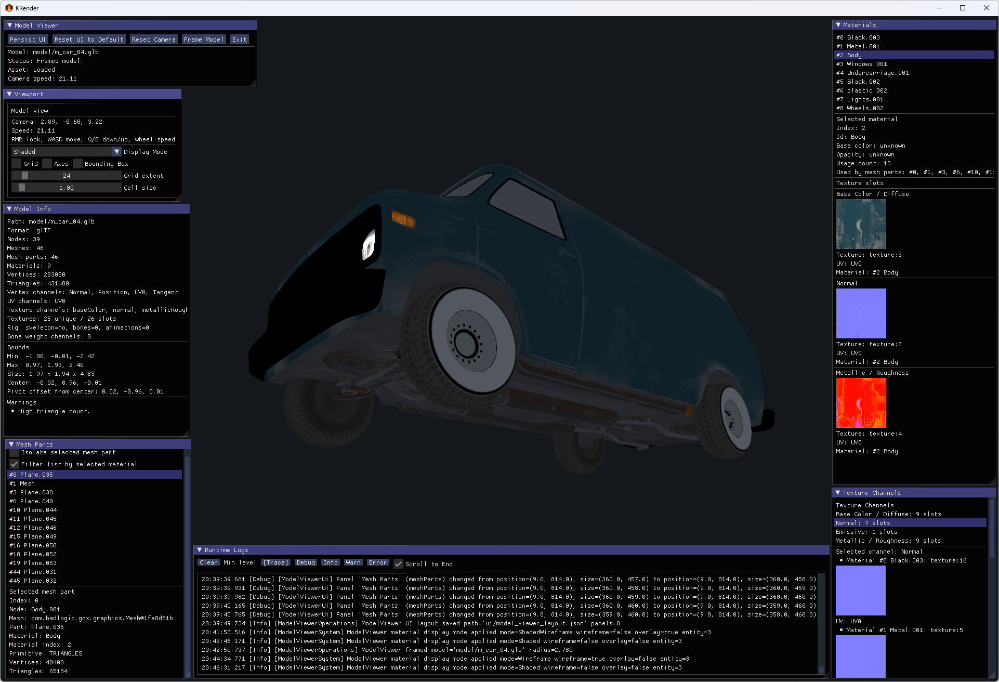
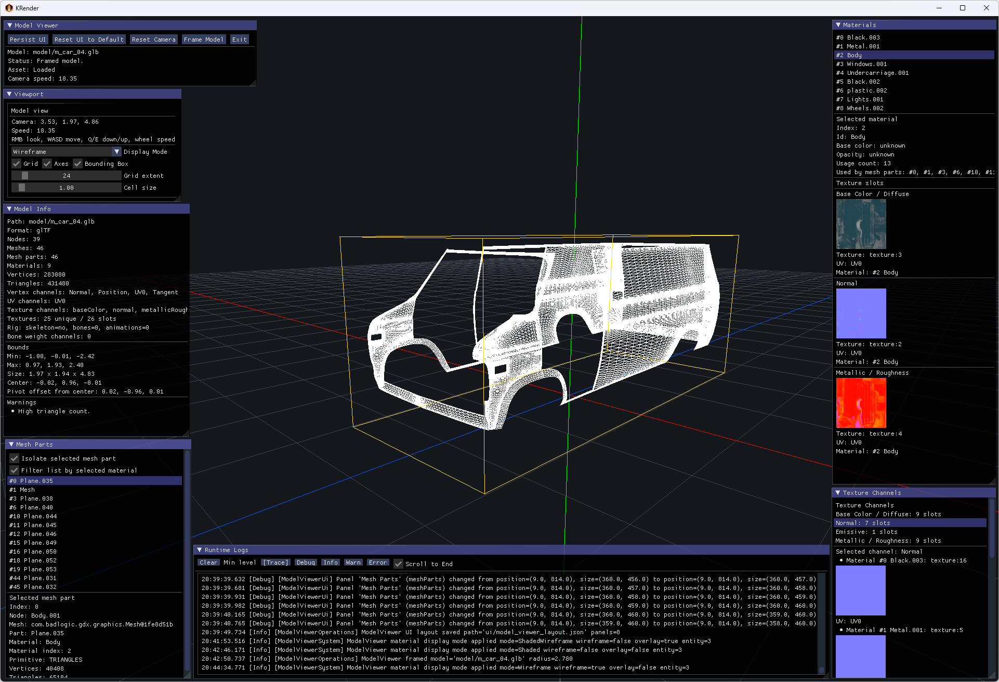

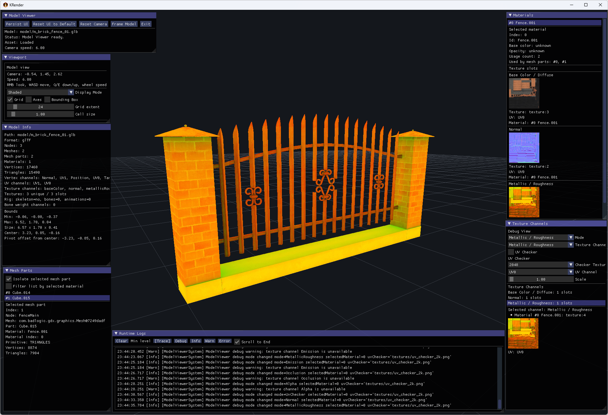


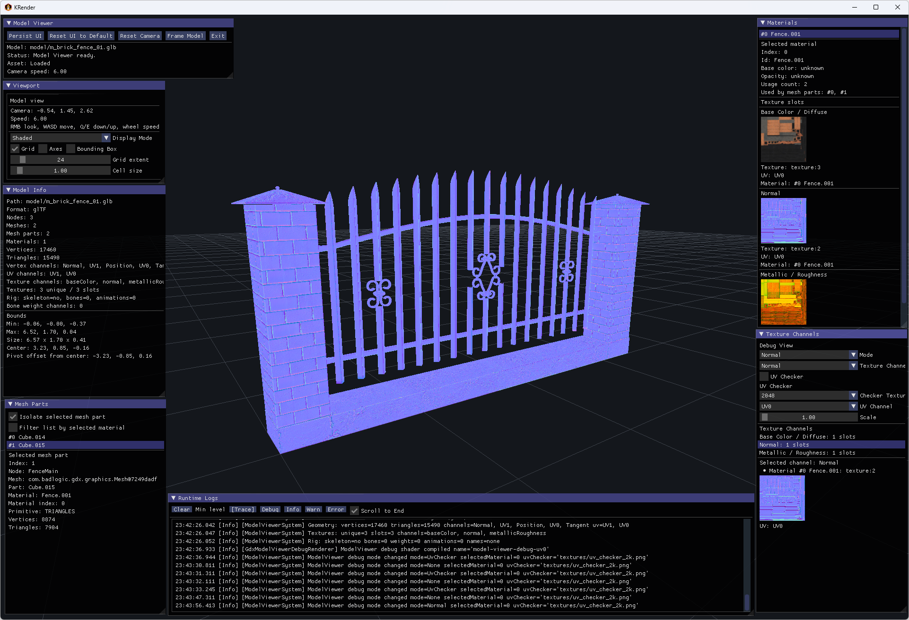

Required properties:

- `krender.scene=model-viewer`
- `krender.model.path=<path>`

Example:

```sh
./gradlew :lwjgl3:run -Pkrender.scene=model-viewer -Pkrender.model.path=model/example.glb
```

### Animation Viewer

The Animation Viewer is a playback and rig-inspection tool for animated models. It provides clip selection, play/pause/loop/scrub controls, skeleton hierarchy browsing, pose overlays, and model/skeleton combined preview modes.
Features:

- Opens model assets directly from Asset Browser or from a provided model path.
- Loads and displays a single model using the same editor-style viewport/camera workflow as the existing viewer tools.
- Provides viewer toolbar actions for saving and resetting the UI layout, resetting the camera, framing the model, and exiting the tool.
- Supports common viewport helpers such as grid, axes, bounding boxes, wireframe rendering, configurable grid size, and ambient light intensity control.
- Shows available animation clip names, clip durations, and rig metadata such as skeleton presence, bone count, and bone-weight channel count.
- Allows selecting one animation clip for preview.
- Provides Play, Pause, Stop, playback speed, loop toggle, time scrub, and step controls for clip preview.
- Supports `Model`, `Skeleton`, and `Model + Skeleton` view modes.
- Draws a backend-neutral skeleton overlay using sampled parent-child pose lines when skeleton pose data is available.
- Includes a dedicated skeleton panel with hierarchy browsing, bone selection, connected-bone highlighting, optional joint markers, and current sampled bone pose details.
- Shows preview capability status such as `Animation preview: requested`, `available`, `metadata only`, or `unsupported`, and also reports skeleton preview support.
- Surfaces clear warnings when animation duration is unknown, when skeleton pose data is unavailable for the current
  model/backend, or when preview support is limited.
- Includes loading and runtime log panels for inspection and debugging while the asset is being prepared.
- Includes ambient light intensity controls to make motion and poses easier to inspect without introducing a more
  complex lighting rig.
- Falls back safely for static models, models without animation clips, and models where only partial animation metadata
  is available.

Current scope / limitations:

- The tool is currently an MVP viewer for clip and pose inspection.
- It does not implement a full animation graph, blending system, or gameplay animation state machine.
- Animation preview depends on the active backend exposing runtime metadata and preview support for the loaded model
  format.
- Some models may provide skeleton pose previews even when animation clip metadata is missing or incomplete.

Screenshots:

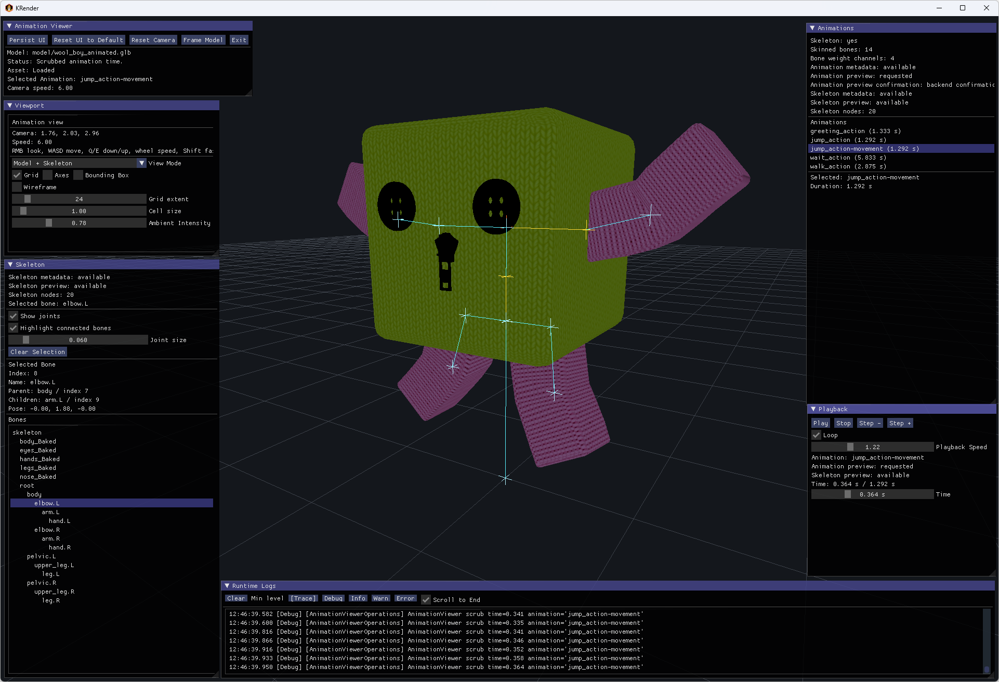
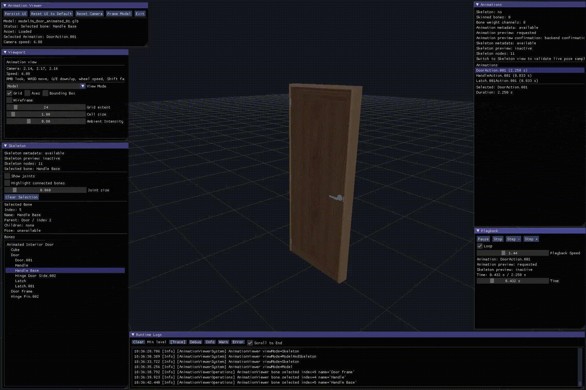


Required properties:

- `krender.scene=animation-viewer`
- `krender.model.path=<path>`

Example:

```sh
./gradlew :lwjgl3:run -Pkrender.scene=animation-viewer -Pkrender.model.path=model/example.glb
```

### Terrain Editor

The Terrain Editor is the terrain authoring tool for KRender heightfields. It loads terrain files, supports sculpt/paint brushes, layer and material preview workflows, save/load, wireframe/stats views, and terrain-focused diagnostics.

Features:

- Create or load terrain assets.
- Configure terrain size and vertex spacing.
- Generate flat terrain, with extension points for noise-based generators.
- Edit terrain using brushes: raise, lower, flatten, smooth, and paint layer.
- Adjust brush radius, strength, falloff, and paint/erase behavior.
- Use undo and redo while editing terrain.
- Manage multiple terrain layers with materials, colors, visibility, tiling, and order.
- Preview terrain using layer colors, material colors, textures, or selected layer masks.
- Save and load terrain data.
- View mesh statistics, hover position, selected layer, preview state, and logs.

Screenshots:


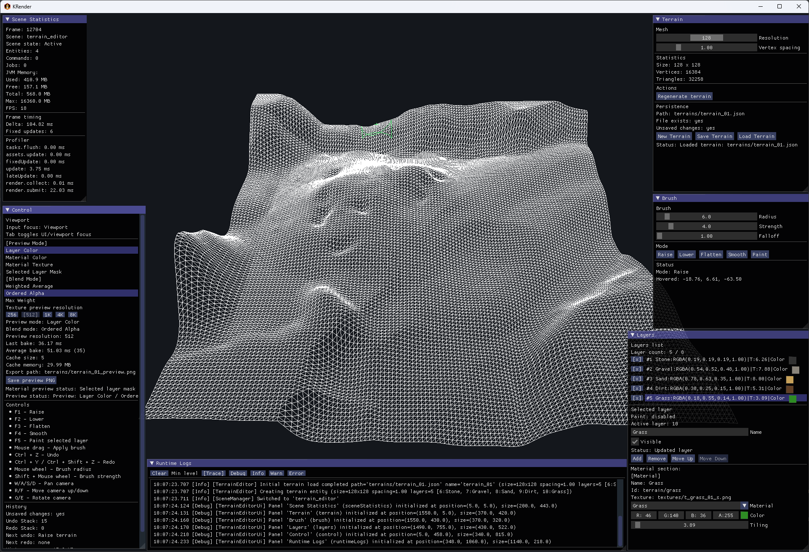

Required properties:

- `krender.scene=terrain-editor`
- `krender.terrain.path=<path>`

Example:

```sh
./gradlew :lwjgl3:run -Pkrender.scene=terrain-editor -Pkrender.terrain.path=terrain/example.krterrain
```

### Scene Editor

The Scene Editor is the `.krscene` authoring tool. It supports hierarchy and inspector workflows, asset placement, selection, transforms, camera/light setup, editor gizmos, and launching a saved scene into the runtime player.
It is currently an MVP editor focused on the core scene-building workflow: placing assets, editing transforms, configuring cameras and lights, selecting objects, and running the scene in a separate runtime window.

Features:

- Create new scene files with default camera and light setup.
- Open, save, and save-as `.krscene` documents.
- Place model and terrain assets into the scene.
- Create empty entities, cameras, directional lights, and point lights.
- Edit entity names, active state, transforms, cameras, and light properties.
- Select entities from the viewport.
- Use hierarchy, inspector, asset placement, toolbar, viewport, and logs panels.
- Configure active camera settings and align camera/view when needed.
- Configure scene lighting, including ambient light, directional lights, and point lights.
- Render scene models and terrain assets in the editor viewport.
- Display editor helpers such as grid, axes, selected bounds, and light gizmos.
- Launch the saved scene in a separate runtime window for preview.

Screenshots:


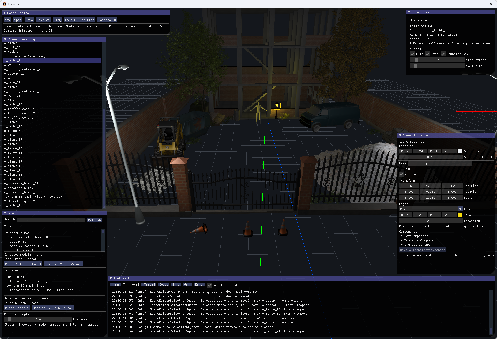


Required properties:

- `krender.scene=scene-editor`

Optional properties:

- `krender.scene.path=<path>`
- `krender.scene.name=<name>`

Example:

```sh
./gradlew :lwjgl3:run -Pkrender.scene=scene-editor -Pkrender.scene.path=scenes/example.krscene
```

### UI Composer

The UI Composer is the `.krui` document tool. Its scope stays focused on inspection, validation, preview, and document-oriented structure workflows rather than a full drag/drop UI authoring suite.

Required properties:

- `krender.scene=ui-composer`
- `krender.ui.scene.path=<path>`

Example:

```sh
./gradlew :lwjgl3:run -Pkrender.scene=ui-composer -Pkrender.ui.scene.path=ui/example.krui
```

## Related Route

### Scene Player

Scene Player is the runtime/player route for `.krscene` files. It is not an editor tool, but it is closely related because Scene Editor and Asset Browser can launch it for scene preview and playback.

Route names:

- `scene-player` preferred route
- `scene-viewer`
- `runtime-scene` legacy alias

Required properties:

- `krender.scene=scene-player`
- `krender.scene.path=<path>`

Example:

```sh
./gradlew :lwjgl3:run -Pkrender.scene=scene-player -Pkrender.scene.path=scenes/example.krscene
```

The legacy command still works:

```sh
./gradlew :lwjgl3:run -Pkrender.scene=runtime-scene -Pkrender.scene.path=scenes/example.krscene
```

## Validation

Use these checks after changing tool code:

```sh
./gradlew :core:compileKotlin :engine:tools:compileKotlin :engine:scene-player:compileKotlin :lwjgl3:compileKotlin
./gradlew :core:test :engine:scene-player:test
```
